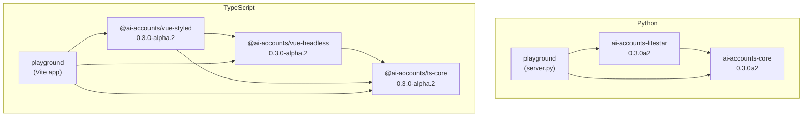
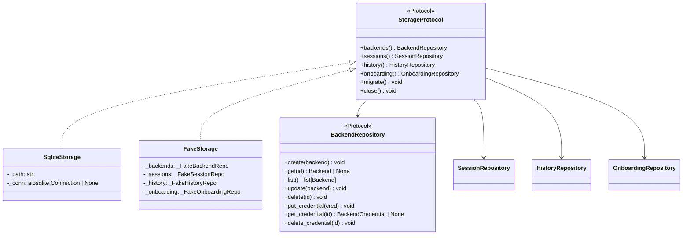

# ai-accounts Architecture Reference (v0.3.0-alpha.1)

## 1. Package Dependency Graph

### Python Workspace (uv)

Root `pyproject.toml` at `/Users/neo/Developer/Projects/ai-accounts/pyproject.toml` declares a uv workspace with three members.

```
ai-accounts-workspace (root, not published)
  ├── packages/core        → ai-accounts-core  v0.3.0a2
  ├── packages/litestar    → ai-accounts-litestar v0.3.0a2  depends on: ai-accounts-core
  └── apps/playground      → ai-accounts-playground v0.0.0   depends on: ai-accounts-core, ai-accounts-litestar, uvicorn
```

**ai-accounts-core** external deps: `msgspec>=0.18`, `aiosqlite>=0.20`, `cryptography>=43.0`, `httpx>=0.27`

**ai-accounts-litestar** external deps: `litestar[standard]>=2.12` (+ ai-accounts-core from workspace)

**ai-accounts-playground** external deps: `uvicorn>=0.30` (+ both workspace packages)

Workspace dev deps (at root): `pytest>=8.0`, `pytest-asyncio>=0.24`, `pytest-cov>=5.0`, `hypothesis>=6.100`, `mypy>=1.11`, `ruff>=0.6`, `httpx>=0.27`

### TypeScript Workspace (pnpm)

Root `package.json` at `/Users/neo/Developer/Projects/ai-accounts/package.json` is a pnpm v9 private workspace.

```
ai-accounts-workspace (root, private)
  ├── packages/ts-core       → @ai-accounts/ts-core  v0.3.0-alpha.2
  ├── packages/vue-headless  → @ai-accounts/vue-headless v0.3.0-alpha.2  depends on: @ai-accounts/ts-core
  ├── packages/vue-styled    → @ai-accounts/vue-styled  v0.3.0-alpha.2  depends on: @ai-accounts/ts-core, @ai-accounts/vue-headless
  ├── apps/playground        → playground v0.0.4   depends on: all three packages above + vue
  └── docs/                  → docs (VitePress site, no cross-package deps)
```

**Mermaid: full dependency graph**



---

## 2. Module Structure Per Package

### `ai-accounts-core` (`packages/core/src/ai_accounts_core/`)

| File | Purpose |
|------|---------|
| `__init__.py` | Package root; exposes `__version__ = "0.2.2"` |
| `ids.py` | `new_id(prefix, length=12)` — CSPRNG prefixed ID generator (62-bit entropy) |
| **domain/** | |
| `domain/__init__.py` | Docstring only: "Domain types — framework-free msgspec structs." |
| `domain/backend.py` | `BackendKind` constants, `BackendStatus` enum, `Backend` struct, `BackendCredential` struct, `DetectResult` struct |
| `domain/session.py` | `SessionKind`, `SessionState` enums; `LiveSession` struct |
| `domain/chat.py` | `ChatRole` enum; `ChatMessage` struct; `ChatSession` struct |
| `domain/pty.py` | `PtySession` struct; `PtyEvent` struct |
| `domain/onboarding.py` | `OnboardingStep` enum; `OnboardingState` struct |
| `domain/principal.py` | `Principal` struct (id, display_name, scopes) |
| **protocols/** | |
| `protocols/__init__.py` | Docstring only: "Typed Protocol interfaces for pluggable layers." |
| `protocols/backend.py` | `Model`, `ChatRequest`, `PtyRequest`, `ChatStreamEvent`, `PtyHandle` Protocol, `BackendProtocol` (the central backend interface) |
| `protocols/storage.py` | `BackendRepository`, `SessionRepository`, `HistoryRepository`, `OnboardingRepository`, `StorageProtocol` — all `@runtime_checkable Protocol` |
| `protocols/auth.py` | `RequestContext` struct; `AuthProtocol` |
| `protocols/vault.py` | `VaultError`; `canonicalize_vault_context()`; `VaultProtocol` |
| `protocols/transport.py` | `TransportProtocol` — `send/receive/close` over `WireEvent` |
| **protocol/** | |
| `protocol/__init__.py` | Docstring: "Wire protocol — framework-free message schemas." |
| `protocol/wire.py` | All wire event structs (`SessionStartEvent`, `SessionEndEvent`, `ChatTokenEvent`, `ChatToolCallEvent`, `ChatDoneEvent`, `PtyOutputEvent`, `PtyResizeEvent`, `PtyExitEvent`, `ErrorEvent`), `WireEvent` union, `encode_wire_event()`, `decode_wire_event()` |
| **login/** | |
| `login/__init__.py` | Re-exports all login public symbols |
| `login/session.py` | `LoginSession` abstract base class |
| `login/events.py` | Discriminated-union event types: `UrlPrompt`, `TextPrompt`, `StdoutChunk`, `ProgressUpdate`, `LoginComplete`, `LoginFailed`, `LoginEvent` union alias, `PromptAnswer` |
| `login/registry.py` | `LoginSessionRegistry` — asyncio-locked in-memory session store with TTL sweep |
| `login/cli_orchestrator.py` | `CliOrchestrator` — PTY subprocess runner; `parse_menu_options()`, `strip_ansi()`, regex constants |
| `login/interactive.py` | `run_interactive_cli_login()` — shared async generator driving any CLI through interactive menus → OAuth URL |
| **metadata/** | |
| `metadata/__init__.py` | Re-exports metadata public symbols |
| `metadata/types.py` | `InstallCheck`, `InputSpec`, `LoginFlowSpec`, `PlanOption`, `BackendMetadata` structs |
| `metadata/registry.py` | `BackendRegistry` — dict keyed by kind; `register()`, `get()`, `list()` |
| **backends/** | |
| `backends/__init__.py` | Re-exports `ClaudeBackend`, `CodexBackend`, `GeminiBackend`, `OpenCodeBackend` |
| `backends/claude.py` | `ClaudeBackend` + `_ClaudeCliBrowserSession` + `_ClaudeApiKeySession` |
| `backends/gemini.py` | `GeminiBackend` + `_GeminiOAuthDeviceSession` + `_GeminiDirectOAuthSession` + `_GeminiApiKeySession` |
| `backends/opencode.py` | `OpenCodeBackend` + `_OpenCodeCliBrowserSession` + `_OpenCodeApiKeySession` |
| `backends/codex.py` | `CodexBackend` + `_CodexOAuthDeviceSession` + `_CodexCliBrowserSession` + `_CodexApiKeySession` |
| **services/** | |
| `services/__init__.py` | Re-exports `AccountService`, `OnboardingService`, all error classes |
| `services/accounts.py` | `AccountService` — orchestrates create/detect/begin_login/store_credential/validate/list_models |
| `services/onboarding.py` | `OnboardingService` — multi-step wizard state machine (start/detect_all/pick_kind/begin_login/finalize) |
| `services/errors.py` | `ServiceError` hierarchy: `BackendNotFound`, `BackendAlreadyExists`, `BackendKindUnknown`, `BackendNotReady`, `BackendValidationFailed`, `CredentialMissing`, `LoginFlowUnsupported` |
| **adapters/** | |
| `adapters/__init__.py` | Docstring only |
| `adapters/auth_apikey.py` | `ApiKeyAuth` — Bearer token auth via `hmac.compare_digest`; `from_env()` factory |
| `adapters/auth_noauth.py` | `NoAuth` — dev-only, accepts all; blocked in production by litestar startup guard |
| `adapters/vault_envkey/__init__.py` | Re-exports `EnvKeyVault` |
| `adapters/vault_envkey/vault.py` | `EnvKeyVault` — AES-256-GCM encryption; `from_env()` factory with dev fallback |
| `adapters/storage_sqlite/__init__.py` | Re-exports `SqliteStorage` |
| `adapters/storage_sqlite/storage.py` | `SqliteStorage` + four private repo classes (`_SqliteBackendRepo`, `_SqliteSessionRepo`, `_SqliteHistoryRepo`, `_SqliteOnboardingRepo`) |
| `adapters/storage_sqlite/schema.sql` | Complete SQL DDL for all tables |
| **cliproxy/** | |
| `cliproxy/__init__.py` | Re-exports `CliproxyInstallResult`, `CliproxyLoginInfo`, and all helper functions |
| `cliproxy/manager.py` | `is_cliproxy_installed()`, `get_cliproxy_version()`, `install_cliproxy()`, `start_cliproxy_login()`, `forward_cliproxy_callback()` |
| **install/** | |
| `install/__init__.py` | Re-exports `InstallCommand`, `InstallResult`, `get_install_strategies`, `install_backend_cli` |
| `install/backend_cli.py` | `install_backend_cli(kind)` — tries npm install strategies per backend kind |
| **testing/** | |
| `testing/__init__.py` | Re-exports `FakeAuth`, `FakeBackend`, `FakeStorage`, `FakeVault`, `run_storage_conformance`, `run_vault_conformance` |
| `testing/fakes.py` | In-memory fakes for all four protocols + `FakeBackend` + `_FakeLoginSession` |
| `testing/storage_conformance.py` | `run_storage_conformance()` — portable conformance suite for `StorageProtocol` |
| `testing/vault_conformance.py` | `run_vault_conformance()` — roundtrip, context-binding, injectivity, tamper-detection tests |

---

### `ai-accounts-litestar` (`packages/litestar/src/ai_accounts_litestar/`)

| File | Purpose |
|------|---------|
| `__init__.py` | `__version__ = "0.2.2"` |
| `config.py` | `AiAccountsConfig` msgspec struct — all wiring options |
| `app.py` | `create_app(config)` — Litestar factory; `_enforce_production_guards()` |
| `dto.py` | HTTP DTOs: `BackendDTO`, `BackendListDTO`, `CreateBackendRequest`, `UpdateBackendRequest`, `DetectResultDTO`, `OnboardingStateDTO`, `PickKindRequest`, `DetectResultsDTO` |
| `errors.py` | `service_error_handler()` — maps `ServiceError.code` to HTTP status codes |
| `routes/backends.py` | `BackendsController` at `/api/v1/backends` — CRUD + detect + validate |
| `routes/login.py` | `LoginController` at `/api/v1/backends/{backend_id}/login` — begin/stream/respond/cancel |
| `routes/onboarding.py` | `OnboardingController` at `/api/v1/onboarding` — start/get/detect/pick/login/finalize |
| `routes/meta.py` | `MetaController` — GET `/api/v1/backends/_meta` |
| `routes/cliproxy.py` | `CliproxyController` at `/api/v1/cliproxy` — status/install/login-begin/callback-forward |
| `routes/install.py` | `InstallController` — POST `/api/v1/backends/{kind}/install` |

---

### `apps/playground` (`apps/playground/`)

| File | Purpose |
|------|---------|
| `server.py` | Wires all four backends + NoAuth + SqliteStorage + EnvKeyVault into `create_app()`; uvicorn on `127.0.0.1:20000` |

---

### `@ai-accounts/ts-core` (`packages/ts-core/src/`)

| File | Purpose |
|------|---------|
| `index.ts` | Full public export barrel |
| `protocol/wire.ts` | `WireEvent` discriminated union + all wire event interfaces (auto-generated from Python) |
| `types/login.ts` | `LoginEvent` union and all constituent types; `PromptAnswer`; `LoginFlowKind` |
| `types/metadata.ts` | `BackendMetadata`, `LoginFlowSpec`, `InputSpec`, `InstallCheck`, `PlanOption` |
| `types/install.ts` | `InstallResult`, `CliproxyStatus`, `CliproxyInstallResult`, `CliproxyLoginBeginResponse`, `CliproxyCallbackForwardResponse` |
| `events.ts` | `AiAccountsEvent` discriminated union (observable bus events); `AiAccountsEventHandler` |
| `client/generated.ts` | OpenAPI-generated `paths` and `operations` interfaces (do not edit) |
| `client/index.ts` | `AiAccountsClient` class — all REST calls + `streamLogin()` SSE |
| `client/login-stream.ts` | `parseSseLoginEvents(response)` — async iterator parsing SSE frames |
| `machines/accountWizard.ts` | `createAccountWizard()` — lightweight state machine for simple (non-OAuth) account addition |
| `machines/onboardingFlow.ts` | `createOnboardingFlow()` — full state machine with OAuth device polling |

---

### `@ai-accounts/vue-headless` (`packages/vue-headless/src/`)

| File | Purpose |
|------|---------|
| `index.ts` | Public barrel |
| `plugin.ts` | `aiAccountsPlugin` Vue plugin — provides `AiAccountsContext` via injection key |
| `injection-keys.ts` | `aiAccountsKey: InjectionKey<AiAccountsContext>` |
| `composables/useAiAccounts.ts` | `useAiAccounts()` — inject context or throw |
| `composables/useBackendRegistry.ts` | `useBackendRegistry()` — reactive backend metadata list |
| `composables/useLoginSession.ts` | `useLoginSession()` — reactive wrapper around `beginLogin`/`streamLogin`/`respondLogin`/`cancelLogin` |
| `useOnboarding.ts` | `useOnboarding()` — bridges `createOnboardingFlow` machine to Vue `ref`s |
| `useAccountWizard.ts` | `useAccountWizard()` — bridges `createAccountWizard` machine to Vue `ref`s |

---

### `@ai-accounts/vue-styled` (`packages/vue-styled/src/`)

| File | Purpose |
|------|---------|
| `index.ts` | Exports five components + imports `tokens.css` |
| `components/AccountWizard.vue` | Opinionated styled wrapper around `useAccountWizard` |
| `components/OnboardingFlow.vue` | Multi-step onboarding UI using `useOnboarding` |
| `components/LoginStream.vue` | Displays SSE login events (URL prompt, text prompt, stdout log) |
| `components/BackendPicker.vue` | Backend kind selection grid fed from `useBackendRegistry` |
| `components/AccountEditForm.vue` | Edit display_name/config for an existing backend |
| `styles/tokens.css` | CSS custom properties (design tokens) |

---

## 3. Protocol / Type Hierarchy

### `BackendProtocol`

Defined in `/Users/neo/Developer/Projects/ai-accounts/packages/core/src/ai_accounts_core/protocols/backend.py`.

```python
@runtime_checkable
class BackendProtocol(Protocol):
    kind: ClassVar[str]
    supported_login_flows: ClassVar[frozenset[str]]
    metadata: ClassVar[BackendMetadata]

    async def detect(self) -> DetectResult: ...
    def begin_login(self, flow_kind: str, config: dict, vault_ctx: dict, isolation_dir: Path) -> LoginSession: ...
    async def validate(self, credential: bytes, *, isolation_dir: Path) -> bool: ...
    async def list_models(self, credential: bytes, *, isolation_dir: Path) -> list[Model]: ...
    async def chat(self, request: ChatRequest, credential: bytes, *, isolation_dir: Path) -> AsyncIterator[ChatStreamEvent]: ...
    async def pty(self, request: PtyRequest, credential: bytes, *, isolation_dir: Path) -> PtyHandle: ...
```

**Concrete implementations:**

| Class | `kind` | `supported_login_flows` | `isolation_env_var` |
|-------|--------|------------------------|---------------------|
| `ClaudeBackend` | `"claude"` | `{"api_key", "cli_browser"}` | `CLAUDE_CONFIG_DIR` |
| `GeminiBackend` | `"gemini"` | `{"api_key", "oauth_device", "direct_oauth"}` | `GEMINI_CLI_HOME` |
| `OpenCodeBackend` | `"opencode"` | `{"api_key", "cli_browser"}` | `OPENCODE_HOME` |
| `CodexBackend` | `"codex"` | `{"api_key", "oauth_device", "cli_browser"}` | `CODEX_HOME` |
| `FakeBackend` (testing) | `"fake"` | `{"api_key", "oauth_device"}` | `None` |

**Note on chat/pty:** `chat()` and `pty()` raise `NotImplementedError("chat lands in Phase 3")` and `NotImplementedError("pty lands in Phase 4")` across all four production backends — these are planned for future milestones.

---

### `LoginSession`

Defined in `/Users/neo/Developer/Projects/ai-accounts/packages/core/src/ai_accounts_core/login/session.py`.

```python
class LoginSession(ABC):
    @property @abstractmethod
    def session_id(self) -> str: ...
    @property @abstractmethod
    def backend_kind(self) -> str: ...
    @property @abstractmethod
    def flow_kind(self) -> str: ...
    @property @abstractmethod
    def done(self) -> bool: ...
    @abstractmethod
    async def events(self) -> AsyncIterator[LoginEvent]: ...
    @abstractmethod
    async def respond(self, answer: PromptAnswer) -> None: ...
    @abstractmethod
    async def cancel(self) -> None: ...
```

**Concrete implementations (all private; created by `BackendProtocol.begin_login`):**

```mermaid
classDiagram
    class LoginSession {
        <<abstract>>
        +session_id: str
        +backend_kind: str
        +flow_kind: str
        +done: bool
        +events() AsyncIterator[LoginEvent]
        +respond(answer) void
        +cancel() void
    }

    class _ClaudeCliBrowserSession {
        +flow_kind = "cli_browser"
        -_orchestrator: CliOrchestrator
        -_answers: asyncio.Queue
    }
    class _ClaudeApiKeySession {
        +flow_kind = "api_key"
    }
    class _GeminiOAuthDeviceSession {
        +flow_kind = "oauth_device"
    }
    class _GeminiDirectOAuthSession {
        +flow_kind = "direct_oauth"
        -_CLIENT_ID: str
        -_REDIRECT_URI: str
        -_code_verifier: str
        -_state: str
    }
    class _GeminiApiKeySession {
        +flow_kind = "api_key"
    }
    class _OpenCodeCliBrowserSession {
        +flow_kind = "cli_browser"
    }
    class _OpenCodeApiKeySession {
        +flow_kind = "api_key"
    }
    class _CodexOAuthDeviceSession {
        +flow_kind = "oauth_device"
    }
    class _CodexCliBrowserSession {
        +flow_kind = "cli_browser"
    }
    class _CodexApiKeySession {
        +flow_kind = "api_key"
    }
    class _FakeLoginSession {
        +backend_kind = "fake"
    }

    LoginSession <|-- _ClaudeCliBrowserSession
    LoginSession <|-- _ClaudeApiKeySession
    LoginSession <|-- _GeminiOAuthDeviceSession
    LoginSession <|-- _GeminiDirectOAuthSession
    LoginSession <|-- _GeminiApiKeySession
    LoginSession <|-- _OpenCodeCliBrowserSession
    LoginSession <|-- _OpenCodeApiKeySession
    LoginSession <|-- _CodexOAuthDeviceSession
    LoginSession <|-- _CodexCliBrowserSession
    LoginSession <|-- _CodexApiKeySession
    LoginSession <|-- _FakeLoginSession
```



---

### `LoginEvent` — Discriminated Union

Defined in `/Users/neo/Developer/Projects/ai-accounts/packages/core/src/ai_accounts_core/login/events.py`. All use `msgspec` struct tags (the `type` field is the discriminator).

| Struct | `type` tag | Key fields |
|--------|-----------|------------|
| `UrlPrompt` | `"url_prompt"` | `prompt_id`, `url`, `user_code?` |
| `TextPrompt` | `"text_prompt"` | `prompt_id`, `prompt`, `hidden: bool` |
| `StdoutChunk` | `"stdout"` | `text` |
| `ProgressUpdate` | `"progress"` | `label`, `percent?` |
| `LoginComplete` | `"complete"` | `account_id`, `backend_status` |
| `LoginFailed` | `"failed"` | `code`, `message` |

The TypeScript mirror lives in `/Users/neo/Developer/Projects/ai-accounts/packages/ts-core/src/types/login.ts` and is a hand-maintained exact copy.

---

### `BackendMetadata`

Defined in `/Users/neo/Developer/Projects/ai-accounts/packages/core/src/ai_accounts_core/metadata/types.py`. Carried as a `ClassVar` on each `BackendProtocol` implementation.

```python
class BackendMetadata(msgspec.Struct):
    kind: str
    display_name: str
    icon_url: str | None
    install_check: InstallCheck       # {command: list[str], version_regex: str}
    login_flows: list[LoginFlowSpec]  # [{kind, display_name, description, requires_inputs}]
    plan_options: list[PlanOption] | None
    config_schema: dict               # JSON Schema object
    supports_multi_account: bool
    isolation_env_var: str | None
```

This struct is served verbatim via `GET /api/v1/backends/_meta` — the frontend reads it to know which flows to show and which form fields to render.

---

### Storage Protocol Hierarchy



---

### Vault Protocol

Defined in `/Users/neo/Developer/Projects/ai-accounts/packages/core/src/ai_accounts_core/protocols/vault.py`.

```python
class VaultProtocol(Protocol):
    async def encrypt(self, plaintext: bytes, *, context: dict[str, str]) -> bytes: ...
    async def decrypt(self, ciphertext: bytes, *, context: dict[str, str]) -> bytes: ...
    async def current_key_id(self) -> str: ...
    async def rotate(self, old_key_id: str) -> None: ...
```

`context` is canonicalized via `canonicalize_vault_context()` (sorted-items canonical JSON, injective). The `EnvKeyVault` concrete implementation uses AES-256-GCM with a 12-byte random nonce and a 1-byte version envelope prefix.

---

## 4. Public API Surface

### `ai_accounts_core` (`packages/core/src/ai_accounts_core/__init__.py`)

The package `__init__.py` only exports `__version__`. All meaningful symbols are exported from sub-package `__init__.py` files:

**`ai_accounts_core.login`** — re-exports:
- `LoginComplete`, `LoginEvent`, `LoginFailed`, `LoginSession`, `LoginSessionRegistry`, `ProgressUpdate`, `PromptAnswer`, `StdoutChunk`, `TextPrompt`, `UrlPrompt`

**`ai_accounts_core.metadata`** — re-exports:
- `BackendMetadata`, `BackendRegistry`, `InputSpec`, `InstallCheck`, `LoginFlowSpec`, `PlanOption`

**`ai_accounts_core.backends`** — re-exports:
- `ClaudeBackend`, `CodexBackend`, `GeminiBackend`, `OpenCodeBackend`

**`ai_accounts_core.services`** — re-exports:
- `AccountService`, `OnboardingService`, `OnboardingNotFound`, all `ServiceError` subclasses

**`ai_accounts_core.testing`** — re-exports:
- `FakeAuth`, `FakeBackend`, `FakeStorage`, `FakeVault`, `run_storage_conformance`, `run_vault_conformance`

**`ai_accounts_core.cliproxy`** — re-exports:
- `CliproxyInstallResult`, `CliproxyLoginInfo`, `forward_cliproxy_callback`, `get_cliproxy_version`, `install_cliproxy`, `is_cliproxy_installed`, `start_cliproxy_login`

**`ai_accounts_core.install`** — re-exports:
- `InstallCommand`, `InstallResult`, `get_install_strategies`, `install_backend_cli`

**`ai_accounts_core.adapters.storage_sqlite`** — `SqliteStorage`

**`ai_accounts_core.adapters.vault_envkey`** — `EnvKeyVault`

**`ai_accounts_core.adapters.auth_apikey`** — `ApiKeyAuth`

**`ai_accounts_core.adapters.auth_noauth`** — `NoAuth`

**`ai_accounts_core.protocol.wire`** — `WireEvent` union, `encode_wire_event`, `decode_wire_event`, all event structs

---

### `@ai-accounts/ts-core` (`packages/ts-core/src/index.ts`)

Exports (type-only unless noted):

- `WIRE_PROTOCOL_VERSION` (value), all `WireEvent` types
- `AiAccountsClient` (value, class)
- `ClientOptions`, `ApiError`, `BackendDTO`, `DetectResultDTO`, `LoginResponseDTO`, `OAuthDeviceLoginDTO`, `OnboardingStateDTO`, `DetectResultsDTO`
- `AiAccountsApiPaths` (type alias for generated `paths`)
- `LoginEvent`, `UrlPrompt`, `TextPrompt`, `StdoutChunk`, `ProgressUpdate`, `LoginComplete`, `LoginFailed`, `PromptAnswer`, `LoginFlowKind`
- `BackendMetadata`, `InstallCheck`, `InputSpec`, `LoginFlowSpec`, `PlanOption`
- `InstallResult`, `CliproxyStatus`, `CliproxyInstallResult`, `CliproxyLoginBeginResponse`, `CliproxyCallbackForwardResponse`
- `AiAccountsEvent`, `AiAccountsEventHandler`
- `createAccountWizard` (value, function), `AccountWizard`, `WizardState`, `CreateAccountWizardOptions`
- `createOnboardingFlow` (value, function), `OnboardingFlowMachine`, `OnboardingMachineState`, `CreateOnboardingFlowOptions`
- `version` (string literal `'0.0.0'`)

---

### `@ai-accounts/vue-headless` (`packages/vue-headless/src/index.ts`)

- `useAccountWizard` (value), `UseAccountWizardOptions`, `UseAccountWizardReturn`
- `useOnboarding` (value), `UseOnboardingOptions`, `UseOnboardingReturn`
- `aiAccountsPlugin` (value), `AiAccountsPluginOptions`
- `aiAccountsKey` (value, `InjectionKey`), `AiAccountsContext`
- `useAiAccounts` (value)
- `useBackendRegistry` (value)
- `useLoginSession` (value), `UseLoginSession`, `LoginStatus`
- `version = '0.3.0-alpha.1'`

---

### `@ai-accounts/vue-styled` (`packages/vue-styled/src/index.ts`)

- `AccountWizard` (Vue component)
- `OnboardingFlow` (Vue component)
- `LoginStream` (Vue component)
- `BackendPicker` (Vue component)
- `AccountEditForm` (Vue component)
- Side-effect: imports `styles/tokens.css`
- `version = '0.2.0'`

---

### `ai_accounts_litestar` — HTTP Routes

`create_app(config: AiAccountsConfig) -> Litestar` is the sole public factory.

Full route table:

| Method | Path | Handler | Service |
|--------|------|---------|---------|
| GET | `/health` | `health()` | — |
| GET | `/api/v1/backends/` | `list_backends` | `AccountService.list` |
| POST | `/api/v1/backends/` | `create_backend` | `AccountService.create` |
| GET | `/api/v1/backends/{id}` | `get_backend` | `AccountService.get` |
| PATCH | `/api/v1/backends/{id}` | `update_backend` | `AccountService.update` |
| DELETE | `/api/v1/backends/{id}` | `delete_backend` | `AccountService.delete` |
| POST | `/api/v1/backends/{id}/detect` | `detect` | `AccountService.detect` |
| POST | `/api/v1/backends/{id}/validate` | `validate` | `AccountService.validate` |
| POST | `/api/v1/backends/{id}/login/begin` | `begin` | `AccountService.begin_login` |
| GET | `/api/v1/backends/{id}/login/stream` | `stream` (SSE) | `LoginSession.events()` |
| POST | `/api/v1/backends/{id}/login/respond` | `respond` | `LoginSession.respond()` |
| POST | `/api/v1/backends/{id}/login/cancel` | `cancel` | `LoginSession.cancel()` |
| GET | `/api/v1/backends/_meta` | `list_metadata` | `BackendRegistry.list` |
| POST | `/api/v1/backends/{kind}/install` | `install` | `install_backend_cli` |
| POST | `/api/v1/onboarding/` | `start` | `OnboardingService.start` |
| GET | `/api/v1/onboarding/{id}` | `get_state` | `OnboardingService.get` |
| POST | `/api/v1/onboarding/{id}/detect` | `detect` | `OnboardingService.detect_all` |
| POST | `/api/v1/onboarding/{id}/pick` | `pick` | `OnboardingService.pick_kind` |
| POST | `/api/v1/onboarding/{id}/login` | `begin_login` | `OnboardingService.begin_login` |
| POST | `/api/v1/onboarding/{id}/finalize` | `finalize` | `OnboardingService.finalize` |
| GET | `/api/v1/cliproxy/status` | `status` | `is_cliproxy_installed` |
| POST | `/api/v1/cliproxy/install` | `install` | `install_cliproxy` |
| POST | `/api/v1/cliproxy/login/begin` | `login_begin` | `start_cliproxy_login` |
| POST | `/api/v1/cliproxy/login/callback-forward` | `login_callback_forward` | `forward_cliproxy_callback` |

---

## 5. Database Schema

Single SQLite database; schema applied at startup via `SqliteStorage.migrate()` from `/Users/neo/Developer/Projects/ai-accounts/packages/core/src/ai_accounts_core/adapters/storage_sqlite/schema.sql`.

```sql
-- Migration tracking
CREATE TABLE IF NOT EXISTS schema_version (
    version INTEGER PRIMARY KEY
);

-- Registered AI backends (claude, gemini, etc.)
CREATE TABLE IF NOT EXISTS backends (
    id           TEXT PRIMARY KEY,   -- e.g. "bkd-ab3fg9h1k2l0"
    kind         TEXT NOT NULL,      -- "claude" | "gemini" | "opencode" | "codex"
    display_name TEXT NOT NULL,
    config       TEXT NOT NULL,      -- JSON-encoded dict
    status       TEXT NOT NULL,      -- BackendStatus enum value
    created_at   TEXT NOT NULL,      -- ISO 8601 datetime
    updated_at   TEXT,
    last_error   TEXT
);

-- Encrypted credentials (one per backend, ON DELETE CASCADE)
CREATE TABLE IF NOT EXISTS backend_credentials (
    id         TEXT PRIMARY KEY,
    backend_id TEXT NOT NULL UNIQUE REFERENCES backends(id) ON DELETE CASCADE,
    ciphertext BLOB NOT NULL,         -- AES-256-GCM envelope from EnvKeyVault
    key_id     TEXT NOT NULL,         -- e.g. "envkey://v1"
    created_at TEXT NOT NULL,
    expires_at TEXT
);

-- Chat conversation sessions
CREATE TABLE IF NOT EXISTS chat_sessions (
    id         TEXT PRIMARY KEY,
    backend_id TEXT NOT NULL REFERENCES backends(id) ON DELETE CASCADE,
    title      TEXT,
    created_at TEXT NOT NULL,
    updated_at TEXT,
    model      TEXT
);

-- Individual chat messages
CREATE TABLE IF NOT EXISTS chat_messages (
    id          TEXT PRIMARY KEY,
    session_id  TEXT NOT NULL REFERENCES chat_sessions(id) ON DELETE CASCADE,
    role        TEXT NOT NULL,   -- ChatRole enum: "system"|"user"|"assistant"|"tool"
    content     TEXT NOT NULL,
    created_at  TEXT NOT NULL,
    model       TEXT,
    tokens_in   INTEGER,
    tokens_out  INTEGER
);
CREATE INDEX IF NOT EXISTS idx_chat_messages_session ON chat_messages(session_id);

-- In-progress real-time sessions (not CASCADE deleted; reaped by session service)
CREATE TABLE IF NOT EXISTS live_sessions (
    id           TEXT PRIMARY KEY,
    kind         TEXT NOT NULL,   -- "chat" | "pty"
    backend_id   TEXT NOT NULL,
    state        TEXT NOT NULL,   -- "starting"|"active"|"disconnected"|"ended"|"errored"
    started_at   TEXT NOT NULL,
    last_seen_at TEXT NOT NULL
);

-- Multi-step onboarding flows
CREATE TABLE IF NOT EXISTS onboarding (
    id                    TEXT PRIMARY KEY,
    current_step          TEXT NOT NULL,  -- OnboardingStep enum
    selected_backend_kind TEXT,
    created_backend_id    TEXT,
    error                 TEXT
);
```

**Notes:**
- All datetimes stored as ISO 8601 strings (no SQLite `DATETIME` column type used).
- `config` column stores arbitrary JSON; structure validated by the backend's `config_schema` (served via `BackendMetadata`).
- Credentials are stored as raw BLOB (AES-GCM ciphertext). The `key_id` column tracks which vault key encrypted it, enabling future rotation.
- No FK from `live_sessions.backend_id` — intentional; live sessions survive backend updates.
- Schema version is a simple `MAX(version)` table, currently at version 1.

---

## 6. Configuration Types

### `AiAccountsConfig`

Defined in `/Users/neo/Developer/Projects/ai-accounts/packages/litestar/src/ai_accounts_litestar/config.py`.

```python
class AiAccountsConfig(msgspec.Struct, kw_only=True):
    env: Literal["development", "production"] = "development"
    storage: Any = None          # must implement StorageProtocol
    vault: Any = None            # must implement VaultProtocol
    auth: Any = None             # must implement AuthProtocol
    backends: tuple[Any, ...] = ()   # BackendProtocol implementations
    cors_origins: tuple[str, ...] = ()
    backend_dirs_path: Path = Path("./backend_dirs")
    login_session_ttl_seconds: float = 600.0
```

**Production guard** (`_enforce_production_guards`): When `env == "production"`, the startup function refuses to start if:
- `vault` is a fake (class name contains "Fake")
- `auth` is `NoAuth`
- `cors_origins` is empty or contains `"*"`

### `EnvKeyVault.from_env()` — Environment Variables

| Variable | Purpose | Fallback |
|----------|---------|---------|
| `AI_ACCOUNTS_VAULT_KEY` | Base64-encoded 32-byte AES-256 key | Dev: derived from hardcoded seed; Production: raises `RuntimeError` |

### `ApiKeyAuth.from_env()` — Environment Variables

| Variable | Purpose | Fallback |
|----------|---------|---------|
| `AI_ACCOUNTS_API_KEY` | Shared Bearer token | Raises `RuntimeError` if empty |

### Backend Isolation Environment Variables

Each backend receives its credential and isolates state via an env var injected into subprocess calls:

| Backend | Credential env var | Isolation env var |
|---------|--------------------|------------------|
| `ClaudeBackend` | `ANTHROPIC_API_KEY` | `CLAUDE_CONFIG_DIR` |
| `GeminiBackend` | `GEMINI_API_KEY` | `GEMINI_CLI_HOME` |
| `OpenCodeBackend` | `OPENCODE_API_KEY` | `OPENCODE_HOME` |
| `CodexBackend` | `OPENAI_API_KEY` | `CODEX_HOME` |

### ID Prefixes

| Entity | ID prefix | Example |
|--------|-----------|---------|
| Backend | `bkd-` | `bkd-ab3fg9h1k2l0` |
| Credential | `crd-` | `crd-ab3fg9h1k2l0` |
| Onboarding | `onb-` | `onb-ab3fg9h1k2l0` |
| LoginSession | `sess-` | `sess-ab3fg9h1k2` |

All IDs use `new_id(prefix, length=12)` in `ids.py`. Alphabet is `a-z0-9` (36 chars), giving ~62 bits of entropy per 12-character suffix.

---

## 7. Key Execution Flows

### Login Flow (SSE path)

```
Client                    HTTP Layer               AccountService        LoginSession        CLI Process
  |                           |                          |                    |                  |
  |-- POST /login/begin ------>|                          |                    |                  |
  |                           |-- begin_login() -------->|                    |                  |
  |                           |                          |-- begin_login() -->|                  |
  |                           |                          |-- registry.register(session)          |
  |<-- {session_id} ----------|                          |                    |                  |
  |                           |                          |                    |                  |
  |-- GET /login/stream ------>|                          |                    |                  |
  |                           |-- session.events() ------>|                    |                  |
  |                           |                          |                    |-- CliOrchestrator.start() -->|
  |                           |                          |                    |<--- stdout chunks (PTY) ----|
  |<-- SSE: ProgressUpdate ----|                          |                    |                  |
  |<-- SSE: StdoutChunk -------|                          |                    |                  |
  |<-- SSE: UrlPrompt  --------|                          |                    |                  |
  |                           |                          |                    |                  |
  |-- POST /login/respond ----->|                          |                    |                  |
  |                           |-- session.respond(answer)->|                    |                  |
  |                           |                          |-- _answers.put() -->|                  |
  |                           |                          |                    |-- write to PTY -->|
  |<-- SSE: LoginComplete ------|                          |                    |                  |
  |                           |                          |-- registry.remove()                   |
```

### Onboarding Flow (state machine)

```
OnboardingService states: WELCOME → DETECT → PICK_BACKEND → LOGIN → VALIDATE → DONE

POST /api/v1/onboarding/          → start() → creates OnboardingState(WELCOME)
POST /{id}/detect                 → detect_all() → calls impl.detect() for each kind → PICK_BACKEND
POST /{id}/pick {kind}            → pick_kind() → accounts.create() → LOGIN
POST /{id}/login {flow_kind}      → begin_login() → delegates to AccountService.begin_login()
  GET /{backend_id}/login/stream  → SSE stream of LoginEvents
POST /{id}/finalize               → accounts.validate() → DONE (or VALIDATE on error)
```

### Credential Encryption Path

```
store_credential(backend_id, plaintext_bytes):
  1. vault.encrypt(plaintext, context={"backend_id": backend_id})
     → nonce = os.urandom(12)
     → aad = canonical_json(sorted(context.items()))
     → ciphertext = AESGCM.encrypt(nonce, plaintext, aad)
     → envelope = [version_byte=1] + nonce + ciphertext
  2. new BackendCredential(ciphertext=envelope, key_id="envkey://v1")
  3. storage.backends().put_credential(cred)
  4. _update_status(backend, VALIDATING)
```

---

## 8. Architecture Insights

**Layers:**
1. Domain (`domain/`) — pure data, no I/O
2. Protocols (`protocols/`) — `typing.Protocol` interfaces, no implementation
3. Core services (`services/`) — business logic, depends only on protocols
4. Adapters (`adapters/`) — concrete implementations (SQLite, AES vault, API key auth)
5. Backend impls (`backends/`) — per-AI-tool logic, depends only on core
6. HTTP layer (`ai_accounts_litestar`) — Litestar wiring, no business logic leakage
7. TypeScript client (`ts-core`) — mirrors Python wire types, state machines
8. Vue UI layer (`vue-headless` → `vue-styled`) — progressive enhancement

**Design Decisions:**
- `msgspec.Struct` is used instead of Pydantic; all structs are `frozen=True, kw_only=True` — enforces immutability throughout the domain.
- The SSE login stream is the only stateful real-time path; all other routes are request-response. Sessions are held in-process memory (`LoginSessionRegistry`) with TTL sweep, not persisted.
- Backend isolation uses filesystem directories (`backend_dirs_path / backend_id`) so each account's CLI configuration is sandboxed.
- `_GeminiDirectOAuthSession` implements PKCE OAuth2 directly (bypassing the broken Gemini CLI TUI) — the only session that makes outbound HTTP calls during login.
- `CliOrchestrator` uses `pty.fork()` (Unix-only) to drive TTY-requiring CLIs; reads via `loop.run_in_executor` to avoid blocking the event loop.
- `canonicalize_vault_context` uses sorted canonical JSON to make AAD injection binding — designed to resist context-collision attacks between `{"a=b": "c"}` and `{"a": "b=c"}`.
- `FakeVault` intentionally stores plaintext (clearly documented); conformance suites (`run_vault_conformance`, `run_storage_conformance`) ensure third-party adapters pass the same tests as built-in ones.
- `chat()` and `pty()` raise `NotImplementedError` on all backends — these are Phase 3 and Phase 4 features not yet implemented.
- `openapi-typescript` generates `client/generated.ts` from the running server; `AiAccountsClient` is hand-authored on top and imports `paths` purely for type-checking.
- The TypeScript state machines (`createAccountWizard`, `createOnboardingFlow`) are framework-agnostic (no Vue imports); Vue composables (`useAccountWizard`, `useOnboarding`) wrap them in `ref`s via a `machine.subscribe()` callback.

**Observations:**
- `BackendStatus` has a `DETECTING` value but `AccountService.detect()` does not set that status before calling `impl.detect()` — it only sets `NEEDS_LOGIN` on failure. `DETECTING` appears unused in the current service code.
- `LoginComplete.account_id` is always `""` in all production sessions (hardcoded empty string). The field is there for a future pass that writes the final `backend_id` back.
- The `OnboardingMachineState` in TypeScript includes `"oauth_polling"` but the Python `OnboardingService` has no polling endpoint — the TS machine's `pollOnboardingLogin` calls a `/login/poll` endpoint that does not exist in the litestar routes. This is dead TS code that references a planned-but-not-yet-implemented endpoint.
- `_ACTIVE_PROCS` in `routes/cliproxy.py` is a module-level dict — it leaks across requests and will not be GC'd if the reaper task fails. This is an issue for long-running deployments.

---

## 9. Essential Files for New Contributors

**To understand the contract (read first):**
- `/Users/neo/Developer/Projects/ai-accounts/packages/core/src/ai_accounts_core/protocols/backend.py` — the central `BackendProtocol` interface
- `/Users/neo/Developer/Projects/ai-accounts/packages/core/src/ai_accounts_core/login/session.py` — `LoginSession` abstract base
- `/Users/neo/Developer/Projects/ai-accounts/packages/core/src/ai_accounts_core/login/events.py` — all login event types

**To understand the domain:**
- `/Users/neo/Developer/Projects/ai-accounts/packages/core/src/ai_accounts_core/domain/backend.py`
- `/Users/neo/Developer/Projects/ai-accounts/packages/core/src/ai_accounts_core/domain/onboarding.py`

**To understand business logic:**
- `/Users/neo/Developer/Projects/ai-accounts/packages/core/src/ai_accounts_core/services/accounts.py`
- `/Users/neo/Developer/Projects/ai-accounts/packages/core/src/ai_accounts_core/services/onboarding.py`

**To understand the login engine:**
- `/Users/neo/Developer/Projects/ai-accounts/packages/core/src/ai_accounts_core/login/cli_orchestrator.py`
- `/Users/neo/Developer/Projects/ai-accounts/packages/core/src/ai_accounts_core/login/interactive.py`

**To understand a concrete backend:**
- `/Users/neo/Developer/Projects/ai-accounts/packages/core/src/ai_accounts_core/backends/claude.py`

**To understand storage:**
- `/Users/neo/Developer/Projects/ai-accounts/packages/core/src/ai_accounts_core/adapters/storage_sqlite/schema.sql`
- `/Users/neo/Developer/Projects/ai-accounts/packages/core/src/ai_accounts_core/adapters/storage_sqlite/storage.py`

**To understand the HTTP layer:**
- `/Users/neo/Developer/Projects/ai-accounts/packages/litestar/src/ai_accounts_litestar/app.py`
- `/Users/neo/Developer/Projects/ai-accounts/packages/litestar/src/ai_accounts_litestar/config.py`
- `/Users/neo/Developer/Projects/ai-accounts/packages/litestar/src/ai_accounts_litestar/routes/login.py`

**To understand the TypeScript client:**
- `/Users/neo/Developer/Projects/ai-accounts/packages/ts-core/src/client/index.ts`
- `/Users/neo/Developer/Projects/ai-accounts/packages/ts-core/src/machines/onboardingFlow.ts`

**To understand the Vue integration:**
- `/Users/neo/Developer/Projects/ai-accounts/packages/vue-headless/src/plugin.ts`
- `/Users/neo/Developer/Projects/ai-accounts/packages/vue-headless/src/composables/useLoginSession.ts`

**To run the full stack:**
- `/Users/neo/Developer/Projects/ai-accounts/apps/playground/server.py`

**To write a new backend:**
- Implement `BackendProtocol` (three `ClassVar`s + six async methods)
- Write one `LoginSession` subclass per supported flow
- Register via `AiAccountsConfig(backends=(..your_backend..))`
- Add a `BackendMetadata` ClassVar with accurate `install_check`, `login_flows`, `config_schema`