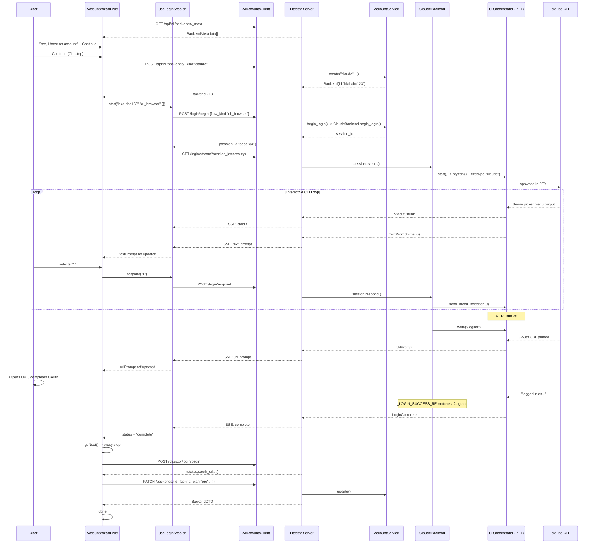
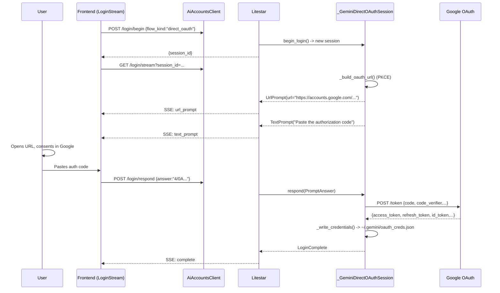
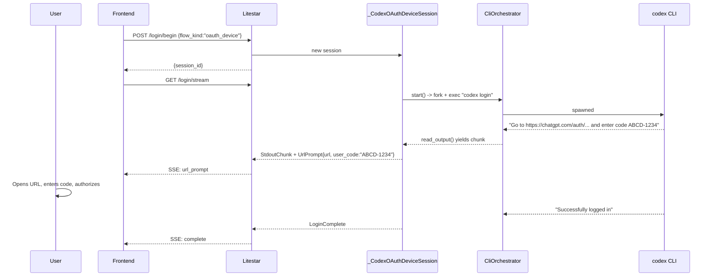
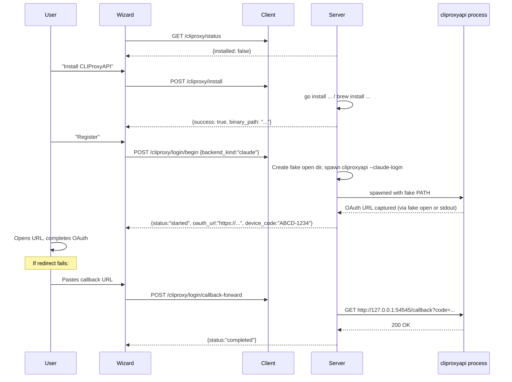

# AI-Accounts: User Scenarios & Technical Call Sequences

> Traced from actual code across two repos:
> - **ai-accounts** (branch `feat/0.3.0-alpha.1`) -- monorepo with packages: `core` (Python), `litestar` (Python routes), `ts-core` (TS client + state machines), `vue-headless` (Vue composables), `vue-styled` (Vue components)
> - **Agented** (branch `main`) -- host app that consumes the ai-accounts packages

---

## Package Architecture Reference

```
ai-accounts/
  packages/
    core/          -- Python domain, services, backends, login, cliproxy, install
    litestar/      -- Python HTTP routes (Litestar controllers)
    ts-core/       -- TS client (AiAccountsClient), state machines, event types
    vue-headless/  -- Vue composables (useLoginSession, useBackendRegistry, useOnboarding, useAccountWizard)
    vue-styled/    -- Vue components (AccountWizard, OnboardingFlow, LoginStream, AccountEditForm, BackendPicker)
```

---

## Scenario 1: First-Run Onboarding

User visits Agented for the first time. The tour system navigates to AI Backends and opens the AccountWizard for Claude.

### Call Sequence

| # | User Action | Frontend | HTTP Request | Python Handler | Side Effects | Response |
|---|---|---|---|---|---|---|
| 1 | App mounts, wizard opens with `initialBackendKind="claude"` | `AccountWizard.vue` `onMounted()` calls `backendRegistry.load()` | `GET /api/v1/backends/_meta` | `MetaController.list_metadata` -> `BackendRegistry.list()` | None | `{ items: [BackendMetadata...] }` -- one per registered backend (claude, gemini, codex, opencode) |
| 2 | Wizard also checks CLIProxyAPI status | `checkCliproxyStatus()` -> `client.cliproxyStatus()` | `GET /api/v1/cliproxy/status` | `CliproxyController.status` -> `is_cliproxy_installed()`, `get_cliproxy_version()` | `shutil.which("cliproxyapi")` | `{ installed: bool, version: str\|null, binary_path: str\|null }` |
| 3 | User sees Step 1 (Subscription). Picks "Yes, I have an account", optionally enters account name and email | Local state: `hasSubscription="yes"`, `accountName`, `email` | None | None | None | None |
| 4 | User clicks Continue -> Step 2 (CLI Setup) | `handleSubscriptionNext()` -> `goNext()` -> `currentStep = "cli"` | None | None | None | None |
| 5 | User sees CLI status. If not installed, clicks "Install CLI" | `installCli()` -> `client.installBackendCli("claude")` | `POST /api/v1/backends/claude/install` | `InstallController.install` -> `install_backend_cli("claude")` | Runs `npm install -g @anthropic-ai/claude-code` via `subprocess`, checks `shutil.which("claude")` | `InstallResult { kind, success, display, stdout, stderr, exit_code, binary_path }` |
| 6 | User clicks Continue -> Step 3 (Login) | `goNext()` -> `currentStep = "login"` triggers watch | None | None | None | None |
| 7 | Watch fires `startUnifiedLogin()` -- creates draft backend | `client.createBackend({ kind: "claude", display_name, config })` | `POST /api/v1/backends/` `{ kind: "claude", display_name: "...", config: { email, config_path, api_key_env } }` | `BackendsController.create_backend` -> `AccountService.create()` | DB insert into backends table, creates isolation dir `<base>/<bkd-XXXXXX>/` | `BackendDTO { id: "bkd-XXXXXX", kind: "claude", status: "unconfigured", ... }` |
| 8 | Picks login flow (`cli_browser` preferred), starts login session | `loginSession.start(accountId, "cli_browser", {})` -> `client.beginLogin(id, "cli_browser", {})` | `POST /api/v1/backends/{id}/login/begin` `{ flow_kind: "cli_browser", inputs: {} }` | `LoginController.begin` -> `AccountService.begin_login()` -> `ClaudeBackend.begin_login("cli_browser")` | Creates `_ClaudeCliBrowserSession`, registers in `LoginSessionRegistry` (in-memory, TTL=600s) | `{ session_id: "sess-XXXXXXXXXX" }` |
| 9 | Opens SSE stream | `client.streamLogin(id, sessionId)` -> `parseSseLoginEvents()` | `GET /api/v1/backends/{id}/login/stream?session_id=sess-...` | `LoginController.stream` -> iterates `session.events()` | Spawns `claude` via PTY (`CliOrchestrator`), env `CLAUDE_CONFIG_DIR=<isolation_dir>` | SSE stream begins |
| 10 | Claude first-run TUI renders theme picker | `run_interactive_cli_login()` detects numbered menu options via `_NUMBERED_OPTION_RE` | SSE: `{ type: "stdout", text: "..." }` then `{ type: "text_prompt", prompt_id: "menu-XXXXXX", prompt: "Choose an option:\n1. Dark mode\n2. Light mode" }` | -- | PTY reads ANSI-stripped output, parses menu | Frontend `useLoginSession.dispatch()` sets `textPrompt` ref |
| 11 | User selects theme (e.g., "1" for Dark) | `loginSession.respond("1")` -> `client.respondLogin(...)` | `POST /api/v1/backends/{id}/login/respond` `{ session_id, prompt_id: "menu-XXXXXX", answer: "1" }` | `LoginController.respond` -> `session.respond(PromptAnswer)` | `_ClaudeCliBrowserSession._answers.put()` -> `run_interactive_cli_login` gets answer -> `orchestrator.send_menu_selection(0)` sends arrow-down*0 + Enter to PTY | 204 No Content |
| 12 | After menus dismissed, REPL goes idle for 2s, `/login` command auto-sent | `run_interactive_cli_login` idle tick detects `idle_since_last_output >= repl_idle_trigger_seconds` | SSE: `{ type: "progress", label: "Sent /login" }` | -- | Writes `/login\r` to PTY master fd | Progress event to frontend |
| 13 | Claude prints OAuth URL | `_CLAUDE_CONSOLE_URL_RE` matches `https://console.anthropic.com/...` | SSE: `{ type: "url_prompt", prompt_id: "auth", url: "https://console.anthropic.com/..." }` | -- | URL extracted from ANSI-stripped PTY output | Frontend `useLoginSession.dispatch()` sets `urlPrompt` ref, `LoginStream.vue` renders clickable link |
| 14 | User opens URL in browser, completes OAuth | -- | -- | -- | Browser auth completes, Claude CLI detects auth via filesystem | -- |
| 15 | Claude prints success message matching `_LOGIN_SUCCESS_RE` | Idle grace period (`login_success_grace_seconds=2s`) then loop exits | SSE: `{ type: "complete", account_id: "", backend_status: "validating" }` | -- | PTY terminated, `session._done = True`, session removed from registry | Frontend `loginSession.status` -> `"complete"` |
| 16 | Login complete watch fires, wizard advances to proxy step | `watch(loginSession.status)` -> `goNext()` -> `currentStep = "proxy"` | None | None | None | None |
| 17 | User sees CLIProxyAPI step (if supported for claude). Clicks "Register" | `runProxyLogin()` -> `client.cliproxyLoginBegin("claude", configDir)` | `POST /api/v1/cliproxy/login/begin` `{ backend_kind: "claude", config_dir: "..." }` | `CliproxyController.login_begin` -> `start_cliproxy_login()` | Spawns `cliproxyapi --claude-login` with fake `open` in PATH to capture OAuth URL. Reads stdout for URL/device code/success markers | `{ status: "started", message: "...", oauth_url: "...", device_code: "..." }` or `{ status: "imported", message: "..." }` |
| 18 | If OAuth URL returned, user completes in browser, pastes callback URL | `submitProxyCallback()` -> `client.cliproxyCallbackForward(url)` | `POST /api/v1/cliproxy/login/callback-forward` `{ callback_url: "http://127.0.0.1:54545/callback?code=...&state=..." }` | `CliproxyController.login_callback_forward` -> `forward_cliproxy_callback()` | HTTP GET to `http://127.0.0.1:{port}/callback?code=...&state=...` via httpx | `{ status: "completed", message: "..." }` |
| 19 | User advances to Plan step. Selects a plan (Pro/Max/API), clicks Save | `saveAccount()` -> `client.updateBackend(id, { display_name, config: { plan, is_default, ... } })` | `PATCH /api/v1/backends/{id}` `{ display_name: "...", config: { email, config_path, plan: "pro", is_default: true } }` | `BackendsController.update_backend` -> `AccountService.update()` | DB update of backends row | `BackendDTO` with updated fields |
| 20 | Wizard shows "Done" step | `currentStep = "done"`, emits `wizard.account.created` and `wizard.closed` events via bus | None | None | None | None |



---

## Scenario 2: Adding a Second Claude Account

User already has one Claude account. From the BackendDetailPage or "Add Account" button, the wizard opens with `initialBackendKind="claude"`.

### Call Sequence

| # | User Action | Frontend | HTTP | Python Handler | Side Effects | Response |
|---|---|---|---|---|---|---|
| 1 | Clicks "Add Account" -> wizard opens with `initialBackendKind="claude"` | `AccountWizard.vue` mounts with prop `initialBackendKind="claude"` | `GET /api/v1/backends/_meta` (via `backendRegistry.load()`) | `MetaController.list_metadata` | None | `{ items: [...] }` |
| 2 | Subscription step: "Yes" + optional custom account name "Work" | Local: `accountName = "Work"`, `suggestConfigPath()` generates `~/.claude-work` | None | None | None | None |
| 3 | CLI step: CLI already installed from first account | `checkCli()` reads `backendRegistry.get("claude")` -- metadata exists | None | None | None | `cliInstalled = true` |
| 4 | Login step: creates new draft backend with isolated config path | `client.createBackend({ kind: "claude", display_name: "Work", config: { config_path: "~/.claude-work" } })` | `POST /api/v1/backends/` | `BackendsController.create_backend` -> `AccountService.create()` | New DB row `bkd-YYYYYY`, new isolation dir `<base>/bkd-YYYYYY/` | `BackendDTO` |
| 5 | Login begins with `cli_browser` flow | Same as Scenario 1 steps 8-15 | Same | Same | New PTY session with `CLAUDE_CONFIG_DIR` pointing to new isolation dir | Same |
| 6 | Proxy registration (optional) | Same as Scenario 1 steps 17-18 | Same | Same | Registers second account with CLIProxyAPI | Same |
| 7 | Plan step: selects plan, saves | `client.updateBackend("bkd-YYYYYY", ...)` | `PATCH /api/v1/backends/{id}` | `BackendsController.update_backend` | DB update | `BackendDTO` |

Key difference: Multi-account isolation is achieved via unique `isolation_dir` per backend ID. The `CLAUDE_CONFIG_DIR` env var ensures the new `claude` CLI instance uses a separate config directory.

---

## Scenario 3: Adding a Gemini Account via Direct OAuth

User picks Gemini in the wizard and uses the `direct_oauth` flow (PKCE-based, no CLI TUI needed).

### Call Sequence

| # | User Action | Frontend | HTTP | Python Handler | Side Effects | Response |
|---|---|---|---|---|---|---|
| 1 | Wizard opens, user picks Gemini | `backendKind = "gemini"` | `GET /api/v1/backends/_meta` | `MetaController.list_metadata` | None | metadata includes `GeminiBackend.metadata` with `login_flows: [oauth_device, direct_oauth, api_key]` |
| 2 | Subscription + CLI steps | Same pattern as above | -- | -- | -- | -- |
| 3 | Login step: draft backend created | `client.createBackend({ kind: "gemini", ... })` | `POST /api/v1/backends/` | `AccountService.create()` | DB row + isolation dir | `BackendDTO` |
| 4 | `pickLoginFlow()` returns `"cli_browser"` (not in gemini flows) -> falls to `"oauth_device"` or based on `login_flows` order. But `direct_oauth` must be selected by the host. If using `useLoginSession` directly: | `loginSession.start(id, "direct_oauth", {})` -> `client.beginLogin(id, "direct_oauth", {})` | `POST /api/v1/backends/{id}/login/begin` `{ flow_kind: "direct_oauth" }` | `LoginController.begin` -> `AccountService.begin_login()` -> `GeminiBackend.begin_login("direct_oauth")` | Creates `_GeminiDirectOAuthSession(config, isolation_dir)`, generates PKCE `code_verifier` + `code_challenge`, builds Google consent URL with `access_type=offline`, `response_type=code`, `redirect_uri=https://codeassist.google.com/authcode` | `{ session_id: "sess-..." }` |
| 5 | SSE stream begins | `client.streamLogin(id, sessionId)` | `GET /api/v1/backends/{id}/login/stream?session_id=...` | `LoginController.stream` -> `session.events()` | -- | SSE events begin |
| 6 | Session emits Google consent URL | -- | SSE: `{ type: "url_prompt", prompt_id: "oauth", url: "https://accounts.google.com/o/oauth2/v2/auth?client_id=681255809395-...&redirect_uri=https://codeassist.google.com/authcode&response_type=code&scope=...&code_challenge=...&state=..." }` | `_GeminiDirectOAuthSession.events()` -> `_build_oauth_url()` | PKCE state/verifier stored in session | Frontend shows clickable URL |
| 7 | Session emits text prompt for auth code | -- | SSE: `{ type: "text_prompt", prompt_id: "auth_code", prompt: "Paste the authorization code from Google", hidden: false }` | -- | Waits on `_answers` queue | Frontend shows input field |
| 8 | User opens URL, consents, copies auth code, pastes it | `loginSession.respond(authCode)` | `POST /api/v1/backends/{id}/login/respond` `{ session_id, prompt_id: "auth_code", answer: "4/0A..." }` | `LoginController.respond` -> `session.respond()` | `_answers.put(PromptAnswer)` unblocks `events()` generator | 204 |
| 9 | Token exchange | -- | SSE: (processing) | `_exchange_code(auth_code)` -> `httpx.AsyncClient.post("https://oauth2.googleapis.com/token", data={code, client_id, redirect_uri, grant_type, code_verifier})` | HTTP POST to Google token endpoint | Tokens received |
| 10 | Credentials written to filesystem | -- | -- | `_write_credentials(tokens)` | Writes `~/.gemini/oauth_creds.json` with `{ access_token, refresh_token, scope, token_type, id_token, expiry_date }`. If `~/.cli-proxy-api/` exists and email configured, also writes `~/.cli-proxy-api/gemini-{email}.json` | Files written |
| 11 | Login complete | -- | SSE: `{ type: "complete", account_id: "", backend_status: "validating" }` | `session._done = True` | Session removed from registry | Frontend advances |



---

## Scenario 4: Adding a Codex Account via OAuth Device Flow

User picks Codex and uses the `oauth_device` flow.

### Call Sequence

| # | User Action | Frontend | HTTP | Python Handler | Side Effects | Response |
|---|---|---|---|---|---|---|
| 1 | Wizard, subscription, CLI steps | Same pattern | -- | -- | -- | -- |
| 2 | Draft backend created | `client.createBackend({ kind: "codex", ... })` | `POST /api/v1/backends/` | `AccountService.create()` | DB + isolation dir | `BackendDTO` |
| 3 | Login with `oauth_device` | `loginSession.start(id, "oauth_device", {})` | `POST /api/v1/backends/{id}/login/begin` `{ flow_kind: "oauth_device" }` | `AccountService.begin_login()` -> `CodexBackend.begin_login("oauth_device")` | Creates `_CodexOAuthDeviceSession(isolation_dir)` | `{ session_id }` |
| 4 | SSE stream begins | `GET /login/stream?session_id=...` | -- | `session.events()` | Spawns `codex login` via PTY (`CliOrchestrator`) with `CODEX_HOME=<isolation_dir>` | SSE stream |
| 5 | Codex prints device URL + code | `_CODEX_URL_RE` matches `https://chatgpt.com/auth/...`, `_CODEX_USER_CODE_RE` extracts `XXXX-XXXX` | SSE: `{ type: "stdout", text: "..." }` then `{ type: "url_prompt", prompt_id: "device", url: "https://chatgpt.com/auth/...", user_code: "ABCD-1234" }` | -- | URL + code parsed from CLI output | Frontend renders URL link + device code display |
| 6 | User opens URL in browser, enters code, authorizes | No frontend action needed -- CLI polls internally | -- | -- | Codex CLI completes OAuth device flow | -- |
| 7 | CLI prints success marker | `_CODEX_SUCCESS_MARKERS` matches "Successfully logged in" | SSE: `{ type: "complete", account_id: "", backend_status: "validating" }` | `session._done = True`, `orchestrator.wait()` checks exit code | Process exits 0 | Frontend `loginSession.status = "complete"` |
| 8 | User does NOT need to respond -- device flow is passive | `respond()` is a no-op for `_CodexOAuthDeviceSession` | -- | -- | -- | -- |



---

## Scenario 5: Editing an Existing Account

User navigates to a backend's detail page and edits display name and config fields.

### Call Sequence

| # | User Action | Frontend | HTTP | Python Handler | Side Effects | Response |
|---|---|---|---|---|---|---|
| 1 | User opens BackendDetailPage for `bkd-abc123` | Host app loads backend data | `GET /api/v1/backends/bkd-abc123` | `BackendsController.get_backend` -> `AccountService.get()` | DB read | `BackendDTO` |
| 2 | User clicks Edit, `AccountEditForm.vue` renders | Props: `account` (current data), `metadata` (from registry). Form pre-fills `display_name` + config fields from `metadata.config_schema.properties` | None | None | None | None |
| 3 | User changes display name to "Work Claude", updates email | Local reactive `form.display_name = "Work Claude"`, `form.config.email = "work@example.com"` | None | None | None | None |
| 4 | User clicks Save | `submit()` -> `client.updateBackend(account.id, { display_name: "Work Claude", config: { email: "work@example.com" } })` | `PATCH /api/v1/backends/bkd-abc123` `{ display_name: "Work Claude", config: { email: "work@example.com" } }` | `BackendsController.update_backend` -> `AccountService.update()` | DB update: new `display_name`, full `config` replacement, `updated_at = now()` | `BackendDTO` with updated fields |
| 5 | Form emits `saved` event | `emit('saved', updatedAccount)` | None | None | None | Parent component refreshes |

Note: `AccountService.update()` does full config replacement (not merge). The caller must pass the complete new config dict.

---

## Scenario 6: Deleting an Account

### Call Sequence

| # | User Action | Frontend | HTTP | Python Handler | Side Effects | Response |
|---|---|---|---|---|---|---|
| 1 | User clicks Delete on BackendDetailPage | Confirmation dialog | None | None | None | None |
| 2 | User confirms deletion | `client.deleteBackend("bkd-abc123")` | `DELETE /api/v1/backends/bkd-abc123` | `BackendsController.delete_backend` -> `AccountService.delete()` | 1. `AccountService.get()` verifies backend exists (raises `BackendNotFound` if not). 2. `repo.delete(backend.id)` -- DB row removed. 3. `shutil.rmtree(isolation_dir)` -- removes `<base>/bkd-abc123/` directory tree (config, credentials, etc.) | 204 No Content |
| 3 | Frontend navigates away | -- | -- | -- | -- | -- |

Side effects detail:
- The isolation directory (`<isolation_base_dir>/bkd-abc123/`) is deleted with `ignore_errors=True`
- Any credentials stored via `repo.put_credential()` are deleted as part of the DB row cascade
- The `LoginSessionRegistry` is NOT explicitly cleaned (sessions have TTL-based sweep)

---

## Scenario 7: Installing a Backend CLI

User is in the CLI Setup step of the wizard and the CLI is not detected.

### Call Sequence

| # | User Action | Frontend | HTTP | Python Handler | Side Effects | Response |
|---|---|---|---|---|---|---|
| 1 | Wizard shows "CLI not detected" with Install button | `AccountWizard.vue` -- `cliInstalled = false` | None | None | None | None |
| 2 | User clicks "Install CLI" | `installCli()` -> `client.installBackendCli(backendKind)` | `POST /api/v1/backends/{kind}/install` (e.g., `POST /api/v1/backends/claude/install`) | `InstallController.install` -> `install_backend_cli(kind)` | Looks up `_INSTALL_STRATEGIES[kind]`, runs each in order. For `claude`: `subprocess` runs `npm install -g @anthropic-ai/claude-code`, then `shutil.which("claude")` to verify | `InstallResult { kind: "claude", success: true, display: "npm install -g @anthropic-ai/claude-code", stdout: "...", stderr: "...", exit_code: 0, binary_path: "/usr/local/bin/claude" }` |
| 3 | Frontend updates UI | If `success`: `cliInstalled = true`. If failed: `installError = res.stderr` | None | None | None | None |

Install strategies per backend (from `_INSTALL_STRATEGIES`):
- **claude**: `npm install -g @anthropic-ai/claude-code` (check: `claude`)
- **codex**: `npm install -g @openai/codex` (check: `codex`)
- **gemini**: `npm install -g @google/gemini-cli` (check: `gemini`)
- **opencode**: `npm install -g opencode-ai` (check: `opencode`)

---

## Scenario 8: CLIProxyAPI Installation + Registration

User is on the Proxy step of the wizard. CLIProxyAPI is not installed.

### Call Sequence

| # | User Action | Frontend | HTTP | Python Handler | Side Effects | Response |
|---|---|---|---|---|---|---|
| 1 | Proxy step renders, status already checked | `cliproxyInstalled = false` (from `onMounted` check) | Already done: `GET /api/v1/cliproxy/status` | `CliproxyController.status` | `shutil.which("cliproxyapi")` | `{ installed: false, version: null, binary_path: null }` |
| 2 | User clicks "Install CLIProxyAPI" | `installCliproxy()` -> `client.cliproxyInstall()` | `POST /api/v1/cliproxy/install` | `CliproxyController.install` -> `install_cliproxy()` | Tries install commands in order: 1. `go install github.com/.../CLIProxyAPI/cmd/server@latest` (if `go` found), 2. `brew install cliproxyapi` (if `brew` found). Checks `shutil.which("cliproxyapi")` after each | `CliproxyInstallResult { success, display, stdout, stderr, binary_path }` |
| 3 | User clicks "Register with proxy" | `runProxyLogin()` -> `client.cliproxyLoginBegin(kind, configDir)` | `POST /api/v1/cliproxy/login/begin` `{ backend_kind: "claude", config_dir: "~/.claude-work" }` | `CliproxyController.login_begin` -> `start_cliproxy_login()` | 1. Creates temp dir with fake `open`/`xdg-open` scripts that capture URL to file. 2. Spawns `cliproxyapi --claude-login` with modified PATH. 3. Reads stdout for URL/device-code/success markers (10s timeout). 4. If URL captured via fake `open` or stdout regex, returns it | `{ status: "started", message: "...", oauth_url: "https://...", device_code: "XXXX-XXXX" }` or `{ status: "imported", message: "Credentials imported" }` |
| 4a | If `status = "imported"`: credentials were found locally, no browser needed | `proxyLoginStatus = "success"` | None | None | Process killed immediately | None |
| 4b | If `status = "started"`: OAuth URL shown to user | `proxyLoginStatus = "device_auth"`, `proxyOauthUrl` set | None | None | Process kept alive via `asyncio.create_task(_reap())` with 300s timeout | None |
| 5 | User completes OAuth in browser. If redirect fails, pastes callback URL | `submitProxyCallback()` -> `client.cliproxyCallbackForward(callbackUrl)` | `POST /api/v1/cliproxy/login/callback-forward` `{ callback_url: "http://127.0.0.1:54545/callback?code=abc&state=xyz" }` | `CliproxyController.login_callback_forward` -> `forward_cliproxy_callback()` | Parses URL, extracts `code` and `state` params, makes `httpx.AsyncClient.get("http://127.0.0.1:{port}/callback?code=...&state=...")` to cliproxyapi's local HTTP server | `{ status: "completed", message: "Callback forwarded successfully" }` or error |
| 6 | Proxy login complete | `proxyLoginStatus = "success"` | None | None | None | User advances to Plan step |



---

## Scenario 9: Cancelling a Login Mid-Flow

User clicks Cancel during an active SSE login stream.

### Call Sequence

| # | User Action | Frontend | HTTP | Python Handler | Side Effects | Response |
|---|---|---|---|---|---|---|
| 1 | Login SSE stream is active, `loginSession.status = "running"` | `LoginStream.vue` shows Cancel button | SSE stream open | `LoginController.stream` is yielding events | PTY subprocess running | -- |
| 2 | User clicks Cancel | `loginSession.cancel()` -> `client.cancelLogin(accountId, sessionId)` | `POST /api/v1/backends/{id}/login/cancel` `{ session_id: "sess-..." }` | `LoginController.cancel` -> `session.cancel()` then `registry.remove(sessionId)` | -- | 204 No Content |
| 3 | Session cancel executes | -- | -- | For `_ClaudeCliBrowserSession`: `orchestrator.terminate()` sends SIGTERM to PTY child process. For `_GeminiDirectOAuthSession`/`_GeminiApiKeySession`: simply sets `_done = True`. For `_CodexOAuthDeviceSession`: `orchestrator.terminate()` + `orchestrator.wait()` | PTY child killed, master fd closed. Session removed from registry | -- |
| 4 | SSE stream ends | `parseSseLoginEvents()` reader loop exits (response body closes). `loginSession.status = "cancelled"` | SSE stream closes | Generator's `finally` block runs `await registry.remove(session_id)` | Session fully cleaned up | -- |
| 5 | Wizard shows error/retry UI | `loginStatus` computed returns `"error"`. User can click "Try again" to restart | None | None | None | None |

On `AccountWizard.vue` unmount (`onUnmounted`): if `loginSession.status === "running"`, `cancel()` is called automatically.

---

## Scenario 10: Backend Metadata Discovery

On app initialization, the frontend fetches backend metadata to populate the registry. This drives wizard flow selection, install checks, and plan options.

### Call Sequence

| # | Trigger | Frontend | HTTP | Python Handler | Side Effects | Response |
|---|---|---|---|---|---|---|
| 1 | `BackendPicker.vue` mounts or `AccountWizard.vue` mounts | `useBackendRegistry().load()` (if `loaded.value === false`) | `GET /api/v1/backends/_meta` | `MetaController.list_metadata` -> `BackendRegistry.list()` | None (read-only) | `{ items: BackendMetadata[] }` |
| 2 | Response populates registry | `backends.value = result.items`, `loaded.value = true` | -- | -- | -- | -- |

### BackendMetadata shape (per backend):

```typescript
{
  kind: "claude",
  display_name: "Claude Code",
  icon_url: null,
  install_check: { command: ["claude","--version"], version_regex: "(\\d+\\.\\d+\\.\\d+)" },
  login_flows: [
    { kind: "cli_browser", display_name: "Sign in with browser", description: "...", requires_inputs: [] },
    { kind: "api_key", display_name: "API key", description: "...", requires_inputs: [{ name: "api_key", label: "API key", kind: "secret" }] }
  ],
  plan_options: [
    { id: "pro", label: "Claude Pro", description: "$20/mo" },
    { id: "max", label: "Claude Max", description: "$100+/mo" },
    { id: "api", label: "API", description: "Pay-as-you-go" }
  ],
  config_schema: { type: "object", properties: { email: {type:"string"}, config_path: {type:"string"}, plan: {type:"string"} } },
  supports_multi_account: true,
  isolation_env_var: "CLAUDE_CONFIG_DIR"
}
```

### How metadata drives the wizard

- **`BackendPicker.vue`**: Lists all backends from `registry.backends.value`, shows install status badge
- **`AccountWizard.vue`**:
  - `backendMeta.value?.login_flows` -> `pickLoginFlow()` selects preferred flow (`cli_browser` > `oauth_device` > `api_key`)
  - `backendMeta.value?.plan_options` -> renders plan picker on the Plan step (only Claude has plan options; others skip)
  - `backendMeta.value?.config_schema.properties` -> `AccountEditForm.vue` generates form fields dynamically
  - `backendMeta.value?.install_check` -> install step knows expected binary name
  - `PROXY_SUPPORTED_KINDS` (hardcoded `["claude","codex","gemini"]`) -> controls proxy step visibility

### Backend registration (server-side)

The `BackendRegistry` is populated at app startup. Each backend class has a `metadata: ClassVar[BackendMetadata]` attribute:

| Backend | `kind` | Login Flows | Plan Options |
|---|---|---|---|
| `ClaudeBackend` | `claude` | `cli_browser`, `api_key` | Pro, Max, API |
| `GeminiBackend` | `gemini` | `oauth_device`, `direct_oauth`, `api_key` | None |
| `CodexBackend` | `codex` | `oauth_device`, `cli_browser`, `api_key` | None |
| `OpenCodeBackend` | `opencode` | `cli_browser`, `api_key` | None |

---

## Appendix: Key File Paths

### ai-accounts repo

| Layer | Path | Purpose |
|---|---|---|
| Domain | `packages/core/src/ai_accounts_core/domain/backend.py` | `Backend`, `BackendCredential`, `DetectResult`, `BackendKind`, `BackendStatus` |
| Domain | `packages/core/src/ai_accounts_core/domain/onboarding.py` | `OnboardingState`, `OnboardingStep` |
| Services | `packages/core/src/ai_accounts_core/services/accounts.py` | `AccountService` -- CRUD, detect, login, validate, credentials |
| Services | `packages/core/src/ai_accounts_core/services/onboarding.py` | `OnboardingService` -- first-run flow orchestration |
| Backends | `packages/core/src/ai_accounts_core/backends/claude.py` | `ClaudeBackend`, `_ClaudeCliBrowserSession`, `_ClaudeApiKeySession` |
| Backends | `packages/core/src/ai_accounts_core/backends/gemini.py` | `GeminiBackend`, `_GeminiOAuthDeviceSession`, `_GeminiDirectOAuthSession`, `_GeminiApiKeySession` |
| Backends | `packages/core/src/ai_accounts_core/backends/codex.py` | `CodexBackend`, `_CodexOAuthDeviceSession`, `_CodexCliBrowserSession`, `_CodexApiKeySession` |
| Backends | `packages/core/src/ai_accounts_core/backends/opencode.py` | `OpenCodeBackend`, `_OpenCodeCliBrowserSession`, `_OpenCodeApiKeySession` |
| Login | `packages/core/src/ai_accounts_core/login/session.py` | `LoginSession` ABC |
| Login | `packages/core/src/ai_accounts_core/login/events.py` | `LoginEvent` union: `UrlPrompt`, `TextPrompt`, `StdoutChunk`, `ProgressUpdate`, `LoginComplete`, `LoginFailed` |
| Login | `packages/core/src/ai_accounts_core/login/registry.py` | `LoginSessionRegistry` -- in-memory, TTL sweep |
| Login | `packages/core/src/ai_accounts_core/login/cli_orchestrator.py` | `CliOrchestrator` -- PTY-based subprocess with ANSI stripping, menu parsing |
| Login | `packages/core/src/ai_accounts_core/login/interactive.py` | `run_interactive_cli_login()` -- shared interactive loop for TUI CLIs |
| Metadata | `packages/core/src/ai_accounts_core/metadata/types.py` | `BackendMetadata`, `LoginFlowSpec`, `PlanOption`, `InstallCheck`, `InputSpec` |
| Metadata | `packages/core/src/ai_accounts_core/metadata/registry.py` | `BackendRegistry` |
| Install | `packages/core/src/ai_accounts_core/install/backend_cli.py` | `install_backend_cli()`, `_INSTALL_STRATEGIES` |
| CLIProxy | `packages/core/src/ai_accounts_core/cliproxy/manager.py` | `install_cliproxy()`, `start_cliproxy_login()`, `forward_cliproxy_callback()` |
| Routes | `packages/litestar/src/ai_accounts_litestar/routes/backends.py` | `BackendsController` -- CRUD + detect + validate |
| Routes | `packages/litestar/src/ai_accounts_litestar/routes/login.py` | `LoginController` -- begin, stream (SSE), respond, cancel |
| Routes | `packages/litestar/src/ai_accounts_litestar/routes/onboarding.py` | `OnboardingController` -- start, detect, pick, login, finalize |
| Routes | `packages/litestar/src/ai_accounts_litestar/routes/install.py` | `InstallController` -- POST /{kind}/install |
| Routes | `packages/litestar/src/ai_accounts_litestar/routes/meta.py` | `MetaController` -- GET /_meta |
| Routes | `packages/litestar/src/ai_accounts_litestar/routes/cliproxy.py` | `CliproxyController` -- status, install, login/begin, login/callback-forward |
| TS Client | `packages/ts-core/src/client/index.ts` | `AiAccountsClient` -- all HTTP methods |
| TS Client | `packages/ts-core/src/client/login-stream.ts` | `parseSseLoginEvents()` -- SSE parser |
| TS Types | `packages/ts-core/src/types/login.ts` | `LoginEvent`, `LoginFlowKind`, `PromptAnswer` |
| TS Types | `packages/ts-core/src/types/metadata.ts` | `BackendMetadata`, `LoginFlowSpec`, etc. |
| TS Types | `packages/ts-core/src/types/install.ts` | `InstallResult`, `CliproxyStatus`, etc. |
| Machines | `packages/ts-core/src/machines/accountWizard.ts` | `createAccountWizard()` -- simple state machine |
| Machines | `packages/ts-core/src/machines/onboardingFlow.ts` | `createOnboardingFlow()` -- full onboarding state machine with OAuth polling |
| Events | `packages/ts-core/src/events.ts` | `AiAccountsEvent` discriminated union for telemetry bus |
| Vue Plugin | `packages/vue-headless/src/plugin.ts` | `aiAccountsPlugin` -- provides `AiAccountsContext` via injection |
| Composables | `packages/vue-headless/src/composables/useLoginSession.ts` | `useLoginSession()` -- reactive SSE login session |
| Composables | `packages/vue-headless/src/composables/useBackendRegistry.ts` | `useBackendRegistry()` -- cached metadata fetch |
| Composables | `packages/vue-headless/src/composables/useAiAccounts.ts` | `useAiAccounts()` -- inject client + emit |
| Composables | `packages/vue-headless/src/useAccountWizard.ts` | `useAccountWizard()` -- Vue wrapper for `createAccountWizard` |
| Composables | `packages/vue-headless/src/useOnboarding.ts` | `useOnboarding()` -- Vue wrapper for `createOnboardingFlow` |
| Components | `packages/vue-styled/src/components/AccountWizard.vue` | Multi-step wizard (subscription, CLI, login, proxy, plan, done) |
| Components | `packages/vue-styled/src/components/OnboardingFlow.vue` | Simpler onboarding flow (welcome, detect, pick, login, done) |
| Components | `packages/vue-styled/src/components/LoginStream.vue` | SSE login renderer (URL prompt, text prompt, stdout, cancel) |
| Components | `packages/vue-styled/src/components/AccountEditForm.vue` | PATCH display_name + config form |
| Components | `packages/vue-styled/src/components/BackendPicker.vue` | Grid of backend cards from registry metadata |

### Agented repo (host integration)

| Path | Purpose |
|---|---|
| `frontend/src/main.ts` | Installs `aiAccountsPlugin` with client + event handler |
| `frontend/src/services/api/backend-management.ts` | Agented-specific backend management API calls |
| `frontend/src/views/BackendDetailPage.vue` | Hosts `AccountEditForm`, delete button, account details |
| `frontend/src/composables/useTourMachine.ts` | Tour system that opens AccountWizard during onboarding |
