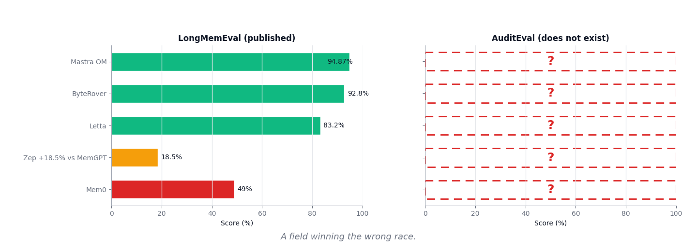
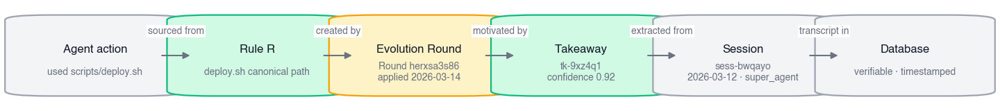
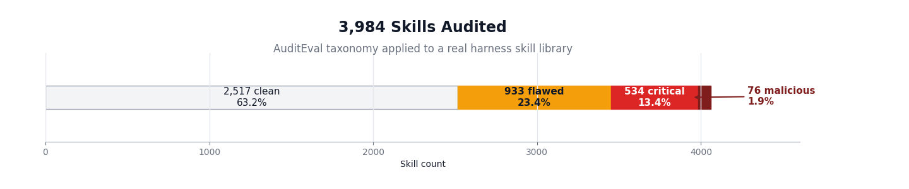
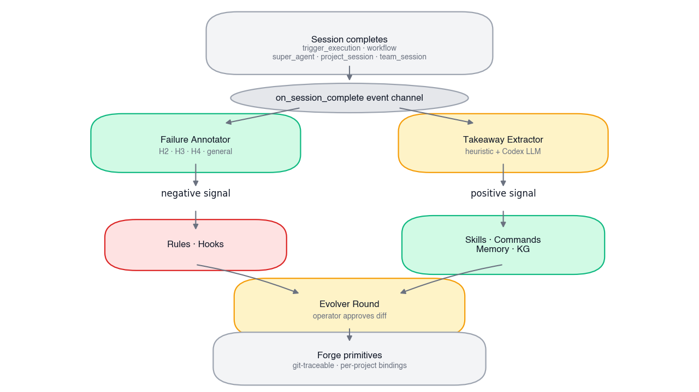
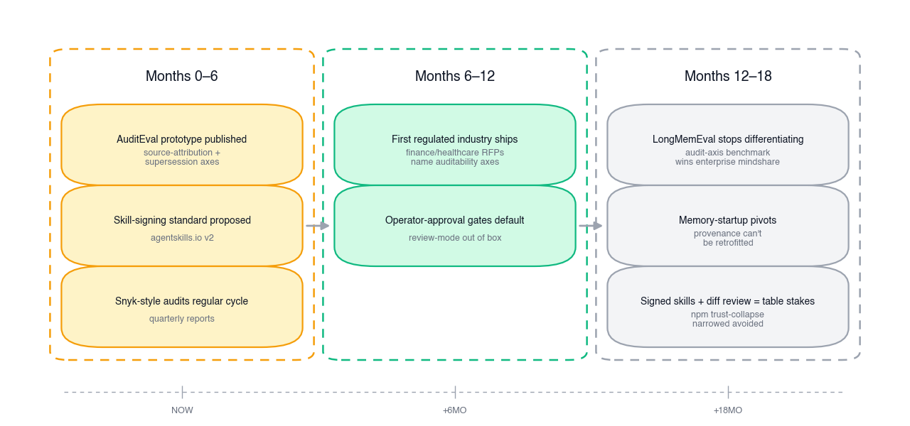

# 당신의 에이전트는 메모리 문제가 아니다. 출처(Provenance) 문제다.

**언어:** [English](./BLOG-self-improving-harness.md) · 한국어 (현재)

*메모리 벤치마크는 이미 정리됐다. [Mastra OM](https://github.com/mastra-ai/mastra)은 LongMemEval에서 94.87%를 내고, [Letta](https://www.letta.com/blog/letta-v1-agent)는 약 83.2%, [Zep/Graphiti](https://arxiv.org/abs/2501.13956)는 MemGPT를 18.5% 차이로 앞서며 지연을 90% 줄였다. 예산에 맞춰 고르면 된다. 문제는, LongMemEval이 에이전트 메모리에서 차지하는 위치가 BLEU가 기계번역에서 차지했던 위치와 같다는 것이다 — 운영자가 실제로 필요로 하는 것을 희생시켜 가며 분야 전체가 집단적으로 이기고 있는 프록시 지표. 이 벤치마크를 통과하는 에이전트들은 첫 감사를 견디지 못할 것이다. 그 이유와, 다음에 올 것을 여기에 적는다.*

## 분야가 자축하고 있는 벤치마크

2026년 공개 에이전트-메모리 엔지니어링의 적지 않은 비율이 이제 [LongMemEval](https://www.emergentmind.com/topics/longmemeval-benchmark)에 대한 최적화다 — 500개의 큐레이트된 질문, 6개 범주(단일 세션 회상, 선호 회상, 지식 업데이트, 시간 추론, 다중 세션 회상 등), 헤드라인 지표는 정확도. 리더보드는 빠르게 움직인다. [Mem0의 State of AI Agent Memory 2026](https://mem0.ai/blog/state-of-ai-agent-memory-2026)에 따르면 [Mastra OM](https://github.com/mastra-ai/mastra)이 94.87%로 — 기록된 최고치 — 그 뒤를 Letta가 약 83.2%, Mem0 자신이 시간 하위 과제에서 약 49%로 따른다. [Zep의 Graphiti 논문](https://arxiv.org/abs/2501.13956)(arXiv 2501.13956)은 이벤트가 발생한 시점과 수집된 시점을 모두 추적하는 양시간(bi-temporal) 지식 그래프를 통해 LongMemEval 변형에서 MemGPT 대비 18.5% 정확도 향상과 90% 지연 감소를 보고한다.

리더보드의 모양을, 정직하게 그리면:

이것은 진짜 엔지니어링이다. 왼쪽 막대들 뒤의 아키텍처는 정교하다. [Letta](https://docs.letta.com/concepts/letta/)는 코어 메모리(항상-프롬프트-내)와 아카이벌 메모리(요청 시 질의)를 도구 호출로 에이전트가 스스로 편집하는, LLM-운영체제 프레이밍을 개척했다. [Mastra](https://deepwiki.com/mastra-ai/mastra/7-memory-and-storage-architecture)는 워킹 메모리(리소스 스코프 또는 스레드 스코프), 시맨틱 회상, 플러그형 스토리지 어댑터를 제공한다. [Cognee](https://www.cognee.ai/blog/fundamentals/how-cognee-builds-ai-memory)는 도메인별 커스텀 그래프 모델로 RAG-투-그래프를 한다. [Hermes Agent](https://github.com/NousResearch/hermes-agent) — 95.6K 스타, 2025년 가장 주목받은 에이전트 프로젝트 중 하나 — 는 파일 기반 하네스 상태([agentskills.io](https://agentskills.io/home) 오픈 표준에 따른 SOUL.md / MEMORY.md / USER.md / 스킬 문서)를 SQLite + FTS5 위에서 돌린다. 작업물은 좋다. 벤치마크가 포화되는 데는 이유가 있다.

아무도 대놓고 말하고 싶어 하지 않는 문제가 여기 있다: **벤치마크가 잘못된 것을 측정하고 있고**, 그것을 이기는 프로젝트들이 잘못된 것을 제대로 하고 있다.

## LongMemEval이 측정하지 않는 것 (그리고 그것이 왜 중요한가)

LongMemEval은 에이전트가, 어쩌면 여러 세션 전에 들은 사실을, 다양한 메모리 압박 하에서 올바르게 회상할 수 있는지를 테스트한다. 이것은 *검색(retrieval)* 벤치마크다 — 정교하고, 잘 만들어졌으며, 그것이 측정하는 것에 대해 유용하다. 그것이 측정하지 *않는* 것은 프로덕션에서 에이전트를 파괴하는 실패 모드다. 그것을 **출처 부패(provenance rot)**라고 부르자.

에이전트가 배포 스크립트가 `scripts/deploy.sh`에 있다고 올바르게 회상한다. 만점. 그런데 운영자가 당연한 다음 질문을 한다: *그게 어디서 왔지?* 규제 당국이 실제로 필요로 하는 감사 사슬은 이렇게 생겼다:

LongMemEval은 위 사슬이 종단 간 해소되든, 절반쯤 낡은 임베딩 청크에 대한 시맨틱 유사도로부터 환각되든, "scripts/deploy.sh"라고 말하는 에이전트에 동일한 점수를 준다. 그 규칙이 나중에 대체됐나 — 누군가 리팩터링해서 스크립트를 `scripts/release/`로 옮겼나? 그 규칙을 만든 테이크어웨이가 실제로 일어난 세션에서 왔나, 아니면 조용히 거짓말한 파서에서 왔나? 규제 당국이 6개월 뒤 "에이전트가 장애를 촉발한 그날 배포 절차에 대해 무엇을 알고 있었나"를 물으면, 시스템이 답할 수 있나?

LongMemEval은 이 중 어느 것도 테스트하지 않는다. 회상이 타임스탬프와 세션 ID를 가진 검증 가능한 이벤트에 근거하든, 절반쯤 낡은 임베딩 청크에 대한 시맨틱 유사도로부터 환각되든, "scripts/deploy.sh"라고 말하는 에이전트에 동일한 점수를 준다. 벤치마크는 표면 속성(올바른 검색)을 최적화하면서 프로덕션 속성(감사 가능한 검색)에는 구조적으로 눈멀어 있다. 이것은 기계번역이 [BLEU](https://en.wikipedia.org/wiki/BLEU)와 함께 10년간 살았던 상황과 정확히 같다: 분야가 수년간 성공적으로 최적화하다가, 그 이득이 *프록시*에서의 이득이었지 근본 능력에서의 이득이 아니었음을 깨달은 프록시 지표. n-gram 축에서의 유창성은 좋아졌지만 원문 의미에 대한 충실성은 뒤처졌다. 누군가 그 시스템을 실제 작업에 배포하려 하기 전까지 모두가 자축했다.

같은 모양이 지금 벌어지고 있다. 우리에게는 검색 압박 하에서 94.87%의 사실을 회상하는, 그러나 그 사실 중 단 하나라도 감사자에게 정당화해 보라고 하는 순간 블랙박스가 되는 에이전트들이 있다. 출처 없이 높은 정확도의 메모리는, 기업이 신뢰할 수 있는 어떤 의미에서도 메모리가 아니다. 그것은 줄이 더 긴 유창한 확률적 앵무새다. 분야가 표면 속성을 최적화하는 이유는 리더보드가 보상하는 것이 표면 속성이기 때문이다.

## 왜 이것이 6개월 전보다 2026년 5월에 더 중요한가

출처 부패의 유일한 결과가 규제상의 불편함뿐이라면, 로드맵에 올려두고 내년에 출하해도 된다. 그 결과가 2월에 더 구체적이 됐다.

2026년 2월 5일, [Snyk Labs가 ToxicSkills 감사를 발표했다](https://snyk.io/blog/toxicskills-malicious-ai-agent-skills-clawhub/) — agentskills.io 오픈 표준 하의 AI 에이전트 스킬에 대한 첫 대규모 보안 감사. 공개 등록된 3,984개 스킬에서 발견한 내역:

3,984개 중: 1,467개(36.8%)가 최소 하나의 보안 결함을 가졌다. 534개(13.4%)가 심각(critical) 수준 문제를 가졌다. **76개가 확인된 악성 페이로드를 담고 있었다** — 의도적 자격증명 절도, 리버스 셸, 데이터 탈취. 악성 스킬의 91%가 전통적 멀웨어 패턴과 프롬프트 인젝션을 결합했는데, 이는 LLM 안전 메커니즘과 기존 MCP 보안 스캐너를 모두 무력화하는 융합이다. 2주 뒤, [최초의 조직적 스킬 멀웨어 캠페인](https://www.agensi.io/learn/toxicskills-clawhavoc-agent-skills-security-crisis-2026)이 — ClawHub 레지스트리를 통해 배포되어 — 30개 이상의 무기화된 스킬로 Claude Code와 OpenClaw 사용자를 표적했다. 코넬의 연구자들은 이미 [SkillSieve](https://arxiv.org/html/2604.06550v1), 악성 스킬 탐지를 위한 계층적 분류 프레임워크를 제안했는데, 기존 생태계에 답이 없기 때문이다. ClawHub에 스킬을 게시하는 장벽은 SKILL.md 하나와 일주일 된 GitHub 계정이다. 서명도, 검토도, 기본 샌드박스도 없다.

이것은 출처 질문을 "당신의 에이전트를 감사할 수 있나"에서 "*당신의 에이전트가 내재화한 것 중 무엇이 악성인지 아는가*"로 바꾼다. 스킬은 더 이상 에이전트가 컨텍스트에 로드한 절차적 지식만이 아니다. 그것은 당신의 파일시스템에 읽기 권한을, 당신의 셸에 쓰기 권한을 가진 공격 표면이며, 2015년 npm의 보안 성숙도와 2025년 npm의 위협 모델을 가진 패키지 레지스트리를 통해 배포된다. 자율 스킬 생성을 추가하려 경쟁하는 모든 플랫폼 — Hermes Agent의 `skill_manage` 도구, Letta의 자기편집 메모리, 그 외 대여섯 — 이 기본적으로 이 위험을 떠안는다. 새 스킬을 디스크에 쓰는 것으로 "학습"하는 에이전트는, 구조적으로, 의존성을 내려받은 것이다.

npm 평행이론은 미묘하지 않다. JavaScript 생태계가 서명, 감사, 락파일, 공급망 증명을 개발하는 데 10년 넘게 걸렸고, 지금도 유지보수되지 않는 전이 의존성 하나가 포춘 500 빌드를 침해할 수 있다. 에이전트-스킬 생태계는 그 궤적을 LLM 속도로 반복하고 있으며, 게다가 산출물이 자연어를 해석하는 도구에 의해 실행되는 지시문-내장-마크다운이라 정적 분석이 의미 있게 더 어렵다는 복잡성이 더해진다. 분야가 최적화하는 벤치마크 — 큐레이트된 채팅 이력에서의 정확도 — 는 이 중 어느 것도 측정하지 않는다. 측정할 수 없다. 벤치마크가 위협 모델보다 먼저 존재했다.

## 감사 가능한 아키텍처가 실제로 어떻게 생겼는가

여기에 대한 하나의 구체적 답을 — 이야기의 영웅으로서가 아니라, 출처를 첫날부터 진지하게 받아들였을 때 아키텍처에서 무엇이 떨어져 나오는지의 구체적 예시로서 — 짚어보고 싶다. 우리는 [Agented](https://github.com/ca1773130n/Agented)를 기존 하네스들([Claude Code](https://github.com/anthropics/claude-code), [Codex CLI](https://github.com/openai/codex), [Cline](https://github.com/cline/cline), Hermes Agent) 위의 메타-오케스트레이션 계층으로 만들었고, 몇 달 전 우리의 테스트-통과 추출기 파이프라인이 프로덕션에서 무슨 일이 벌어지는지에 대해 90분 창에서 열두 번 우리에게 거짓말하는 것을 본 뒤 출처 문제를 진지하게 받아들이기 시작했다. 그 결과는 LongMemEval에서는 딱히 인상적이지 않은(측정한 적 없다) 시스템이지만, 아무도 아직 이름 붙이지 않은 문제를 푸는 시스템이다. 그 패턴을, 추상화하면:

그 척추부터 보자: 보유된 모든 믿음은 그 소스 이벤트로 태깅된다. 세션이 테이크어웨이를 생산하면, 그것은 안정적 `tk-*` ID, 원래 대화를 가리키는 `session_kind` + `session_id` 포인터, 그것을 생산한 추출기 버전, 신뢰도 점수와 함께 `session_takeaways`에 안착한다. 그 테이크어웨이가 규칙이나 스킬이나 지식 그래프 노드가 될 때, 그 자산은 속성에 `source_takeaway_id`를 지닌다. 관계는 양방향으로 질의 가능하다. 규제 당국이 "에이전트가 왜 X를 했나"를 물으면 답이 역방향으로 사슬을 이룬다: 에이전트가 규칙 R을 호출 → 규칙 R은 진화 라운드 E가 생성 → 라운드 E는 테이크어웨이 T1, T2, T3에 의해 동기화 → 그 테이크어웨이는 세션 S1, S2, S3에서 추출 → 그 세션은 전체 트랜스크립트와 함께 데이터베이스의 영속 기록. 사슬의 모든 고리는 타임스탬프를 가진 테이블의 한 행이다. 어느 것도 임베딩 블롭에 대한 유사도로 점수화되지 않는다.

그 척추에 두 개의 증거 스트림이 흘러든다 — 비대칭이고, 둘 다 감사된다. Life-Harness 논문은 세션에서 무엇이 잘못됐는지 분류하는 4계층 실패 분류 체계(H2 인터페이스 / H3 환경 계약 / H4 궤적 규제 / 일반)를 제안했다. 우리는 그 분류기를 모든 완료된 세션에 *실패 주석기*로 실행한다. 또한 *테이크어웨이 추출기* — 휴리스틱 + Codex LLM — 를 실행해 일곱 종류의 긍정 신호(선호, 절차, 도구 패턴, 제약, 도메인 사실, 근본 원인, 성공 패턴)를 표면화한다. 둘 다 동일한 `session_complete` 이벤트 채널에서 하류로 흐른다:

비대칭성이 중요하다: 실패는 규칙과 훅을 원하고, 성공은 스킬과 커맨드를 원한다. 대부분의 에이전트-메모리 프로젝트는 한 방향, 거의 항상 긍정을 고르고, 신호의 절반을 조용히 잃는다. 잘된 것만 감사하면 출처는 작동하지 않는다.

한편 스킬 생성은 자율이 아니라 운영자 승인이다. 테이크어웨이 추출기가 고신뢰 절차 패턴(≥ 0.85 신뢰도, `suggested_target = skill`)을 표면화하면, 산출물은 `.claude/skills/.agented-takeaways/<name>/` 아래에 `SKILL.md` 패키지로 작성된다 — *별도의* 디렉터리, 기본 gitignore됨, 운영자-큐레이트 스킬과 떨어뜨려 둬서 둘 사이의 diff가 `git status` 한 번 거리에 있도록. 그 전에, 테이크어웨이는 큐에 머문다. 운영자는 환경에서 `AGENTED_TAKEAWAY_AUTOAPPLY=1`을 실행하거나(옵트인, 기본 아님) Memory System Settings 탭에서 테이크어웨이를 검토하고 Apply를 클릭한다. 우리가 Snyk의 ToxicSkills 위협 모델 안에 앉아 있다면 — 그렇다 — 유일하게 안전한 기본값은 "에이전트가 제안하고, 운영자가 승인한다"이다. 적용된 모든 스킬은 테이크어웨이 ID, 세션 ID, 신뢰도로의 프론트매터 포인터를 지닌다. 어떤 악성 동작이든 역추적하면 소스 세션이 데이터베이스에 있다. *미*적용 테이크어웨이를 역추적하면 큐에 나타나며, 결코 실행되지 않는다.

같은 이유로 하네스 진화는 별도의 제안 사이클로 돈다. 프로젝트의 하네스 프리미티브(규칙, 훅, 커맨드, MCP 서버)를 변형하고 싶을 때, 우리는 에이전트가 그것을 인-프로세스로 편집하게 하지 않는다. 별도의 진화기 루프를 호출한다: 프로젝트의 현재 Forge 프리미티브 + 최근 궤적 + 최근 테이크어웨이를 임시 스크래치 워크스페이스로 수집하고, 그에 대해 `codex exec --sandbox workspace-write`를 실행하고, 결과 패치를 파싱하고, 스키마에 대해 검증하고, 운영자에게 diff를 제시한다. 패턴은 에이전트 동작에 대한 코드 리뷰다. 모델이 제안하고; 사람이 승인하고; 변경은 프로젝트의 `.claude/` 디렉터리에 대한 `git log` 항목이 된다. Hermes Agent와 Letta는 둘 다 에이전트가 자신의 메모리를 인라인으로 편집하는 변형을 제공한다; 우리는 공개 스킬의 36%가 보안 결함을 가진 세상에서는 변경이 안착하기 전에 diff를 원하기에 제안-검토 변형을 명시적으로 택했다. 우리는 인라인-편집 패턴이 틀렸다고 주장하는 게 아니다. 규제 환경에서 이 시스템을 돌리는 어떤 팀이든 결국 검토 게이트를 추가하게 될 것이며, 첫날부터 그것을 중심으로 설계하는 편이 개조보다 싸다고 주장하는 것이다.

그리고 컴파일은 질의와 분리되어 있다. [Tesserae](https://github.com/ca1773130n/Tesserae) — 타입 지정 지식-그래프 컴파일러 — 는 프로젝트별로 코드, 문서, 에이전트-세션 이력을 수집해 타입 노드(`CodeFile`, `CodeMethod`, `Session`, `SessionDecision`, `SessionInsight`, `SessionTakeaway`)를 가진 단일 `graph.json`을 생산한다. 컴파일은 오프라인이다(N개 세션 후 또는 M분 후). 질의는 MCP stdio 서버를 통해 온라인이며, 운영자가 Tesserae를 활성화하는 순간 우리는 그것을 프로젝트별 Forge 프리미티브로 자동 바인딩한다. 프로젝트의 팀-리더 슈퍼-에이전트는 도구 목록에 `tesserae_ask`, `search_facts`, `graph_ppr`, `find_session_findings`를 얻는다. 운영자가 리더에게 질문하면, 리더의 답은 두 종류의 귀속 행과 함께 스트리밍된다: *Queried*(`Union[str, ToolUseEvent]` 스트림을 통해 전파되어 채팅 상태 서비스에서 전용 `tool_use` 델타로 디스패치된 타입 `tool_use` 이벤트)와 *Cited*(합성된 텍스트에서 추출된 파일 경로, `kge-*` 그래프 ID, `sess-*` 세션 ID, `tk-*` 테이크어웨이 ID). 운영자는 리더가 무엇을 질의했는지와 답이 무엇을 참조하게 됐는지를 모두 본다. 질의한 저장소가 구조화돼 있기에 동작은 감사 가능하다.

종합적 효과는, 현재 사용 중인 어떤 벤치마크에도 포착되지 않는다: 에이전트가 하는 모든 동작은 세션까지 역추적 가능하고, 에이전트가 가진 모든 믿음은 증거 이벤트까지 역추적 가능하며, 에이전트가 가진 모든 스킬은 운영자 결정 또는 승인된 진화 라운드까지 역추적 가능하다. 출처는 우리가 위에 얹은 기능이 아니다. 그것을 설계 제약으로 삼았을 때 아키텍처에서 떨어져 나오는 것이다.

## 12개의 조용한 실패가 출처에 대해 가르쳐 준 것

짧은 막간, 도그푸드 이야기가 출처 문제가 내가 생각했던 것보다 더 이른 곳에서 시작된다고 나를 확신시킨 부분이기 때문이다.

우리 자신의 6개월치 프로덕션 데이터에 대해 이 시스템을 돌리던 어느 90분 창에서, 우리는 열두 개의 조용한 실패를 발견했다. 패턴은 일관됐다: 파이프라인이 성공하고, 테스트가 통과하고, 대시보드는 초록으로 유지되고, 데이터베이스는 파서가 저장하라고 한 것을 정확히 저장했다 — 그리고 데이터는 틀렸다. 어떤 파서는 줄바꿈 구분 Claude JSONL을 기대했으나 실제 저장 형식은 role/content 객체의 JSON 배열이었다. 파서는 0개 이벤트를 반환했다. 테이크어웨이 추출기는 충실하게 아무것도 추출하지 않았다. 대시보드는 "이번 주 테이크어웨이 없음"을 보고했다. 어떤 봇은 22주 동안 매주 일요일 스케줄 실행됐는데, 트리거가 미등록 슬래시 커맨드를 참조했고, Claude는 0으로 종료했으며, 스트림의 결과 이벤트는 문자 그대로 *"Unknown command: /vulnerability-scan"* 문자열을 담고 있었으나 — 아무것도 결과 이벤트를 파싱하지 않았기에, 아무것도 그것을 표면화하지 않았고, 그래서 대시보드는 5개월간 매주 일요일 초록 체크마크를 보고했다.

거기서 나온 규율: 이 파이프라인의 모든 페처, 파서, 추출기는 완료를 선언하기 전에 실제 프로덕션 데이터 ≥3행에 대해 실행되어야 한다. 손으로 만든 입력을 중심으로 한 단위 테스트는 버그가 존재하는 바로 그 이유로 통과한다 — 입력이 파서가 기대한 것과 정확히 같은 모양이었기 때문이다.

이것이 출처에 중요한 이유: **관찰은 출처 원장의 입력 계층이다.** 관찰 단계가 하류 파이프라인에 거짓말하면, 감사 추적은 허구 위에 세워진다. 에이전트는 믿음 B의 소스로 세션 S1을 자신 있게 인용하고; 감사 사슬은 깨끗해 보이고; 실제 세션 S1은 파서가 놓친 조용한 무동작이었다. 출처는 "모든 믿음을 소스 ID로 태깅하라"만이 아니다. 그것은 "소스 ID가 실제로 일어난 이벤트를 가리키도록 하라"이다. 벤치마크는 이것도 테스트하지 않고, 할 수도 없다. 합성 채팅 이력은 프로덕션 관찰 파이프라인의 실패 모드를 복제할 수 없으며, 그것이 도그푸드 패스 — 어느 고리든 믿기 전에 실제 프로덕션 데이터를 사슬의 모든 고리에 통과시키는 것 — 를 타협 불가능하게 만든다.

## 다음 벤치마크가 측정해야 하는 것

LongMemEval은 분야의 헤드라인 지표로 오래가지 않을 것이다. 무언가가 그것을 대체할 것이고, 대체물의 형태는 그 간극에서 부분적으로 보인다. 감사가능성 벤치마크 — AuditEval이라 부르자, 누군가는 쓸 것이다 — 는 현재 어떤 메모리 벤치마크도 테스트하지 않는 최소 다섯 개의 축이 필요하다:

첫째는 **소스 귀속(source attribution)**: 보유된 믿음이 주어졌을 때, 에이전트가 원래 이벤트 — 세션 ID, 트랜스크립트 구간, 타임스탬프 — 를 산출할 수 있나? 임베딩에 대한 코사인 유사도는 통과가 아니며, 올바르게 회상하지만 소스를 가리키지 못하는 에이전트는 실패다. 그 옆에 **대체 추적(supersession tracking)**이 있다: 사실 B가 사실 A를 대체할 때 — 파일이 리네임되고, 절차가 바뀌고, 운영자가 이전 믿음을 명시적으로 무효화했을 때 — 시스템이 A가 이제 역사적이라고 표현할 수 있고, 에이전트가 회상 압박 하에서 A로 손을 뻗는 대신 B를 써야 함을 아는가? 그리고 **신뢰도 보정(confidence calibration)**: 에이전트가 자신이 무엇에 대해 불확실한지 아는가? 하류 정확도와 상관하는 신뢰 구간이 붙은 검색된 사실은, 에이전트가 채점할 수 없는 고정확도 점추정보다 프로덕션에서 더 유용하다.

마지막 두 축은 위협 모델에서 곧장 나온다. **스킬 부하 하의 출처(provenance under skill load)**: 에이전트가 스킬을 — 어쩌면 패키지 레지스트리에서 온 서드파티 스킬을 — 로드할 때, 그 스킬이 주입하는 지식이 출처 메타데이터를 지니며, 운영자가 감사에서 "에이전트가 이것을 세션에서 알았다"와 "에이전트가 출처 불명의 스킬이 말해줘서 이것을 알았다"를 구별할 수 있나? 그리고 **롤백(rollback)**: 운영자가 학습된 휴리스틱을 되돌릴 수 있나 — 구체적으로, 시스템이 3주 전 학습한 규칙이 주어졌을 때, 그것이 비롯된 테이크어웨이와 세션을 식별하고, 규칙을 되돌리고, 에이전트를 재시작하지 않고도 하류 동작이 그에 따라 바뀌게 할 수 있나? 프로덕션 배포는 이것이 필요하다. 현재 어떤 벤치마크도 이것을 테스트하지 않는다.

분야는 AuditEval이 학계에 살지 보안 회사의 마케팅에 살지 결정하면 된다 — 나는 둘 다라고 의심한다 — 그러나 그 같은 무언가의 존재는 이제 불가피하다. 이 시스템을 대규모로 배포하는 첫 규제 산업이, GDPR이 애드테크 회사들의 준비 여부와 무관하게 애드테크를 앞으로 끌어당겼듯, 나머지 분야를 끌어당길 것이다. 최적화 프런티어는 움직일 것이다. 아키텍처가 그것을 위해 설계된 적 없는 프로젝트들은, 옳은 것을 잘못된 계층에 출하했음을 발견하게 될 것이다.

## 다가오는 것

반증 가능하도록 일부러 구체적으로 하는 예측.

향후 12~18개월 안에:

첫 규제 산업(금융, 의료, 국방)이 장기 실행 에이전트를 대규모로 배포하고, 그들의 조달 RFP에 문서화된 감사 요구사항이 프로덕션 에이전트 메모리가 무엇을 의미하는지에 대한 사실상의 사양이 된다; 명명된 메모리-아키텍처 스타트업 중 최소 하나가, 자신의 아키텍처가 바닥부터의 재구축 없이는 출처를 개조할 수 없음을 발견하고, 피벗하거나, 인수되거나, 조용히 리더보드 숫자 출하를 멈춘다.

아직 아무도 분명히 말하지 않는 부분: **메모리와 출처는 같은 문제가 아니며, 둘을 혼동하는 프로젝트들은 두 번째 문제가 더 어려운 문제임을 막 발견하려 한다**. 에이전트-메모리 물결은 인지과학에서 유추를 가져왔다 — 에이전트는 사람이 기억하듯 기억해야 한다. 출처는 다른 유추에서 온다: 에이전트는 동료이며, 어떤 사실을 어디서 배웠는지 말하지 못하는 동료는 당신을 대신해 결정을 내리게 둘 사람이 아니다. 우리는 [Agented](https://github.com/ca1773130n/Agented)를 두 번째 유추를 중심으로 만들었다. 아키텍처 결정은 오픈소스이며; 그 근거는, 마땅히 그래야 했던 만큼 깔끔하게 표현되지 못한 부분까지, 이 에세이에 있다.

분야가 달려온 경주는 잘못된 경주였다. 막 시작되려는 경주가 중요한 경주다.

## 참고문헌

### 언급된 플랫폼과 아이디어
- **Agented** — 공유 프로젝트별 상태에 대해 여러 하네스를 구동하는 메타-오케스트레이션 계층. [github.com/ca1773130n/Agented](https://github.com/ca1773130n/Agented)
- **Tesserae** — Agented의 질의 계층으로 쓰이는 타입 지정 지식-그래프 컴파일러. [github.com/ca1773130n/Tesserae](https://github.com/ca1773130n/Tesserae)
- **Life-Harness** — 이 작업이 기반하는 4계층 실패 분류 체계. 논문: [arxiv.org/abs/2605.22166](https://arxiv.org/abs/2605.22166) · 코드: [github.com/Tianshi-Xu/Life-Harness](https://github.com/Tianshi-Xu/Life-Harness)
- **Model Context Protocol** — 여기 언급된 모든 하네스가 말하는 도구-호출 프로토콜. [github.com/modelcontextprotocol](https://github.com/modelcontextprotocol)

### 논의된 메모리 아키텍처 (허수아비 만들기 아님 — 직접 읽어보라)
- **Mastra** — 94.87% LongMemEval, 워킹 / 스레드 / 시맨틱 메모리 계층. [github.com/mastra-ai/mastra](https://github.com/mastra-ai/mastra) · [메모리 아키텍처 심층](https://deepwiki.com/mastra-ai/mastra/7-memory-and-storage-architecture)
- **Letta** (구 MemGPT) — LLM-as-OS, 도구를 통한 자기편집 메모리. [github.com/letta-ai/letta](https://github.com/letta-ai/letta) · [Agent Memory 블로그](https://www.letta.com/blog/agent-memory)
- **Zep / Graphiti** — 양시간 지식 그래프. [논문: arxiv.org/abs/2501.13956](https://arxiv.org/abs/2501.13956) · [github.com/getzep/zep](https://github.com/getzep/zep)
- **Mem0** — 하이브리드 벡터 / 그래프 / 키-값, LLM 기반 사실 추출. [github.com/mem0ai/mem0](https://github.com/mem0ai/mem0) · [State of AI Agent Memory 2026](https://mem0.ai/blog/state-of-ai-agent-memory-2026)
- **Cognee** — 커스텀 도메인 모델을 가진 RAG-투-그래프. [github.com/topoteretes/cognee](https://github.com/topoteretes/cognee)
- **Hermes Agent** (NousResearch) — 자율 스킬 생성을 가진 파일 기반 하네스 상태. [github.com/NousResearch/hermes-agent](https://github.com/NousResearch/hermes-agent) · [아키텍처 문서](https://hermes-agent.nousresearch.com/docs/developer-guide/architecture)

### 스킬 생태계와 보안 위기
- **Agent Skills 표준** (agentskills.io) — Anthropic 발원, 2025년 12월, 26개 이상 플랫폼. [agentskills.io](https://agentskills.io/home) · [명세](https://github.com/agentskills/agentskills)
- **Snyk ToxicSkills 감사** — 36.8% 결함률, 76개 확인된 악성 페이로드. [snyk.io/blog/toxicskills](https://snyk.io/blog/toxicskills-malicious-ai-agent-skills-clawhub/)
- **스킬-멀웨어 조직적 캠페인** — 30개 이상 무기화된 스킬, 2026년 2월. [agensi.io 보도](https://www.agensi.io/learn/toxicskills-clawhavoc-agent-skills-security-crisis-2026)
- **SkillSieve** — 악성 스킬을 위한 계층적 분류. [arxiv.org/html/2604.06550v1](https://arxiv.org/html/2604.06550v1)

### 벤치마크와 분야
- **LongMemEval 벤치마크** — 현재 메모리 리더보드. [개요](https://www.emergentmind.com/topics/longmemeval-benchmark)
- **하네스 엔지니어링이라는 분야** — awesome 리스트: [github.com/ai-boost/awesome-harness-engineering](https://github.com/ai-boost/awesome-harness-engineering) · [서베이](https://picrew.github.io/LLM-Harness/) · [O'Reilly Radar](https://www.oreilly.com/radar/agent-harness-engineering/)
- **AI 컨트롤 플레인 프레이밍** — [Agent Harness Engineering: The Rise of the AI Control Plane](https://medium.com/@adnanmasood/agent-harness-engineering-the-rise-of-the-ai-control-plane-938ead884b1d)

### 맥락을 위한 하네스들
- [Claude Code](https://github.com/anthropics/claude-code) · [Codex CLI](https://github.com/openai/codex) · [Cline](https://github.com/cline/cline) · [OpenHands](https://github.com/All-Hands-AI/OpenHands) · [Aider](https://github.com/Aider-AI/aider) · [Continue](https://github.com/continuedev/continue) · [Devin](https://devin.ai)
